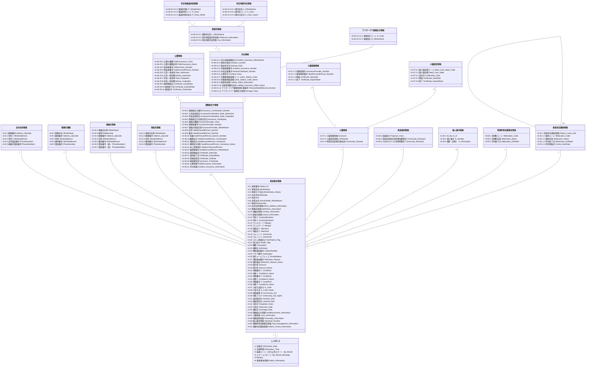

```mermaid
classDiagram
direction BT
    class レスポンス {
        +1 実施日 Information_Date
        +2 実施時間 Information_Time
        +3 結果コード（ゼロ以外エラー） Api_Result
        +4 エラーメッセージ Api_Result_Message
        +5 Reskey
        +6 患者基本情報 Patient_Information
    }

    class 患者基本情報 {
        +6-1 患者番号 Patient_ID
        +6-2 患者氏名 WholeName
        +6-3 患者カナ氏名 WholeName_inKana
        +6-4 生年月日 BirthDate
        +6-5 性別 Sex
        +6-6 世帯主名 HouseHolder_WholeName
        +6-7 続柄 Relationship
        +6-8 自宅住所情報 Home_Address_Information
        +6-9 勤務先情報 WorkPlace_Information
        +6-10 連絡先情報 Contact_Information
        +6-11 帰省先情報 Home2_Information
        +6-12 禁忌１ Contraindication1
        +6-13 禁忌２ Contraindication2
        +6-14 アレルギー１ Allergy1
        +6-15 アレルギー２ Allergy2
        +6-16 感染症１ Infection1
        +6-17 感染症２ Infection2
        +6-18 コメント１ Comment1
        +6-19 コメント２ Comment2
        +6-20 テスト患者区分 TestPatient_Flag
        +6-21 死亡区分 Death_Flag
        +6-22 職業 Occupation
        +6-23 通称名 NickName
        +6-24 携帯電話番号 CellularNumber
        +6-25 ＦＡＸ番号 FaxNumber
        +6-26 電子メールアドレス EmailAddress
        +6-27 減免事由番号 Reduction_Reason
        +6-28 減免事由 Reduction_Reason_Name
        +6-29 割引率 Discount
        +6-30 割引率 Discount_Name
        +6-31 状態番号１ Condition1
        +6-32 状態１ Condition1_Name
        +6-33 状態番号２ Condition2
        +6-34 状態２ Condition2_Name
        +6-35 状態番号３ Condition3
        +6-36 状態３ Condition3_Name
        +6-37 入金方法区分 Ic_Code
        +6-38 入金方法 Ic_Code_Name
        +6-39 地域連携 ID Community_Cid
        +6-40 同意フラグ Community_Cid_Agree
        +6-41 初回受診日 FirstVisit_Date
        +6-42 最終受診日 LastVisit_Date
        +6-43 入院中 Outpatient_Class
        +6-44 入院日 Admission_Date
        +6-45 退院日 Discharge_Date
        +6-46 保険組合せ情報 HealthInsurance_Information
        +6-47 介護情報 Care_Information
        +6-48 患者個別情報 Personally_Information
        +6-49 個人番号情報 Individual_Number
        +6-50 管理料等自動算定情報 Auto_Management_Information
        +6-51 患者禁忌薬剤情報 Patient_Contra_Information
    }

    class 自宅住所情報 {
        +6-8-1 郵便番号 Address_ZipCode
        +6-8-2 住所 1 WholeAddress1
        +6-8-3 住所 2 WholeAddress2
        +6-8-4 自宅電話番号 PhoneNumber1
        +6-8-5 連絡先電話番号 PhoneNumber2
    }

    class 勤務先情報 {
        +6-9-1 勤務先名 WholeName
        +6-9-2 郵便番号 Address_ZipCode
        +6-9-3 住所 WholeAddress1
        +6-9-4 番地番号 WholeAddress2
        +6-9-5 電話番号 PhoneNumber
    }

    class 連絡先情報 {
        +6-10-1 連絡先名称 WholeName
        +6-10-2 続柄 Relationship
        +6-10-3 郵便番号 Address_ZipCode
        +6-10-4 住所 WholeAddress1
        +6-10-5 番地番号 WholeAddress2
        +6-10-6 電話番号（昼） PhoneNumber1
        +6-10-7 電話番号（夜） PhoneNumber2
    }

    class 帰省先情報 {
        +6-11-1 帰省先名称 WholeName
        +6-11-2 郵便番号 Address_ZipCode
        +6-11-3 住所 WholeAddress1
        +6-11-4 番地番号 WholeAddress2
        +6-11-5 電話番号 PhoneNumber
    }

    class 保険組合せ情報 {
        +6-46-1 保険組合せ番号 Insurance_Combination_Number
        +6-46-2 入院負担割合 InsuranceCombination_Rate_Admission
        +6-46-3 外来負担割合 InsuranceCombination_Rate_Outpatient
        +6-46-4 保険組合せ非表示区分 Insurance_Nondisplay
        +6-46-5 保険の種類 InsuranceProvider_Class
        +6-46-6 保険者番号 InsuranceProvider_Number
        +6-46-7 保険の制度名称 InsuranceProvider_WholeName
        +6-46-8 記号 HealthInsuredPerson_Symbol
        +6-46-9 番号 HealthInsuredPerson_Number
        +6-46-10 枝番 HealthInsuredPerson_Branch_Number
        +6-46-11 継続区分 HealthInsuredPerson_Continuation
        +6-46-12 補助区分 HealthInsuredPerson_Assistance
        +6-46-13 補助区分名称 HealthInsuredPerson_Assistance_Name
        +6-46-14 本人家族区分 RelationToInsuredPerson
        +6-46-15 被保険者名 HealthInsuredPerson_WholeName
        +6-46-16 適用開始日 Certificate_StartDate
        +6-46-17 適用終了日 Certificate_ExpiredDate
        +6-46-18 資格取得日 Certificate_GetDate
        +6-46-19 最終確認日 Insurance_CheckDate
        +6-46-20 公費情報 PublicInsurance_Information
        +6-46-21 労災情報 Accident_Insurance_Information
    }

    class 公費情報 {
        +6-46-20-1 公費の種類 PublicInsurance_Class
        +6-46-20-2 公費の種類名称 PublicInsurance_Name
        +6-46-20-3 負担者番号 PublicInsurer_Number
        +6-46-20-4 受給者番号 PublicInsuredPerson_Number
        +6-46-20-5 入院ー負担率 Rate_Admission
        +6-46-20-6 入院ー固定額 Money_Admission
        +6-46-20-7 外来ー負担率 Rate_Outpatient
        +6-46-20-8 外来ー固定額 Money_Outpatient
        +6-46-20-9 適用開始日 Certificate_IssuedDate
        +6-46-20-10 適用終了日 Certificate_ExpiredDate
        +6-46-20-11 確認日付 Certificate_CheckDate
    }

    class 労災情報 {
        +6-46-21-1 労災自賠保険区分 Accident_Insurance_WholeName
        +6-46-21-2 傷病の部位 Disease_Location
        +6-46-21-3 傷病年月日 Disease_Date
        +6-46-21-4 労働保険番号 Accident_Insurance_Number
        +6-46-21-5 年金証書番号 PensionCertificate_Number
        +6-46-21-6 災害区分 Accident_Class
        +6-46-21-7 労働基準監督署コード Labor_Station_Code
        +6-46-21-8 労働基準監督署 Labor_Station_Code_Name
        +6-46-21-9 事業所情報 Liability_Office_Information
        +6-46-21-10 自賠責保険会社名 Liability_Insurance_Office_Name
        +6-46-21-11 アフターケア 健康管理手帳番号 PersonalHealthRecord_Number
        +6-46-21-12 アフターケア 損傷区分情報 Damage_Class
    }

    class 事業所情報 {
        +6-46-21-9-1 事業所名称 L_WholeName
        +6-46-21-9-2 所在地都道府県情報 Prefecture_Information
        +6-46-21-9-3 所在地郡市区情報 City_Information
    }

    class 所在地都道府県情報 {
        +6-46-21-9-2-1 都道府県名 P_WholeName
        +6-46-21-9-2-2 都道府県コード P_Class
        +6-46-21-9-2-3 都道府県の区分 P_Class_Name
    }

    class 所在地郡市区情報 {
        +6-46-21-9-3-1 郡市区名 C_WholeName
        +6-46-21-9-3-2 郡市区コード C_Class
        +6-46-21-9-3-3 郡市の区分 C_Class_Name
    }

    class アフターケア損傷区分情報 {
        +6-46-21-12-1 損傷区分コード D_Code
        +6-46-21-12-2 損傷区分 D_WholeName
    }

    class 介護情報 {
        +6-47-1 介護保険情報 Insurance
        +6-47-2 介護認定情報 Certification
        +6-47-3 地域包括診療対象疾病 Community_Disease
    }

    class 介護保険情報 {
        +6-47-1-1 保険者番号 InsuranceProvider_Number
        +6-47-1-2 被保険者番号 HealthInsuredPerson_Number
        +6-47-1-3 開始 Certificate_StartDate
        +6-47-1-4 終了 Certificate_ExpiredDate
    }

    class 介護認定情報 {
        +6-47-2-1 要介護状態コード Need_Care_State_Code
        +6-47-2-2 要介護状態 Need_Care_State
        +6-47-2-3 認定日 Certification_Date
        +6-47-2-4 開始 Certificate_StartDate
        +6-47-2-5 終了 Certificate_ExpiredDate
    }

    class 患者個別情報 {
        +6-48-1 妊婦区分 Pregnant_Class
        +6-48-2 認知症地域包括診療加算算定 Community_Disease2
        +6-48-3 小児かかりつけ診療料算定 Community_Disease3
    }

    class 個人番号情報 {
        +6-49-1 Id_key In_Id
        +6-49-2 個人番号 In_Number
        +6-49-3 備考（説明） In_Description
    }

    class 管理料等自動算定情報 {
        +6-50-1 管理料コード Medication_Code
        +6-50-2 管理料名称 Medication_Name
        +6-50-3 有効終了日 Medication_EndDate
    }

    class 患者禁忌薬剤情報 {
        +6-51-1 患者禁忌薬剤情報 Patient_Contra_Info
    }

    class 患者禁忌薬剤情報 {
        +6-51-1-1 薬剤コード Medication_Code
        +6-51-1-2 薬剤名称 Medication_Name
        +6-51-1-3 有効終了日 Medication_EndDate
        +6-51-1-4 禁忌開始日 Contra_StartDate
    }

    レスポンス "1" -- "1" 患者基本情報
    患者基本情報 "1" -- "1" 自宅住所情報
    患者基本情報 "1" -- "1" 勤務先情報
    患者基本情報 "1" -- "1" 連絡先情報
    患者基本情報 "1" -- "1" 帰省先情報
    患者基本情報 "1" -- "20" 保険組合せ情報
    患者基本情報 "1" -- "1" 介護情報
    患者基本情報 "1" -- "1" 患者個別情報
    患者基本情報 "1" -- "20" 個人番号情報
    患者基本情報 "1" -- "3" 管理料等自動算定情報
    患者基本情報 "1" -- "1" 患者禁忌薬剤情報
    保険組合せ情報 "1" -- "4" 公費情報
    保険組合せ情報 "1" -- "1" 労災情報
    労災情報 "1" -- "1" 事業所情報
    労災情報 "1" -- "1" アフターケア損傷区分情報
    事業所情報 "1" -- "1" 所在地都道府県情報
    事業所情報 "1" -- "1" 所在地郡市区情報
    介護情報 "1" -- "10" 介護保険情報
    介護情報 "1" -- "50" 介護認定情報
    患者禁忌薬剤情報 "1" -- "100" 患者禁忌薬剤情報
```
