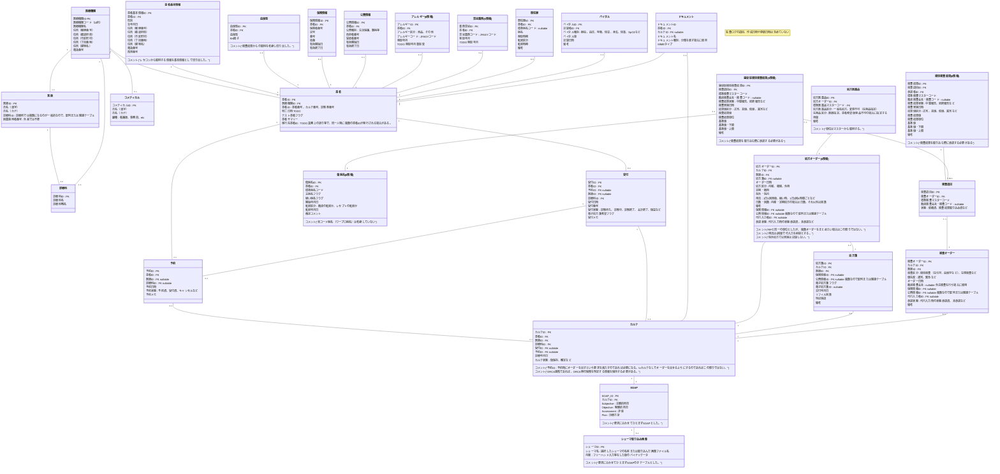

```mermaid
classDiagram
direction TB
    note "監査ログの項目、作成日時や更新日時は含めていない"

    class 医療機関 {
        医療機関ID PK
        医療機関コード（10桁）
        医療機関名
        住所（郵便番号）
        住所（都道府県）
        住所（市区町村）
        住所（丁目番地）
        住所（建物名）
        電話番号
    }
    医療機関 "1" -- "n" 患者

    class 医師 {
        医師ID : PK
        氏名（漢字）
        氏名（カナ）
        診療科ID : 診療所では複数になるのが一般的なので、配列または関連テーブル
        麻薬施用者番号 : 外来では不要
    }
    医療機関 "1" -- "1..n" 医師
    医師 "1" -- "1..n" 診療科

    class コメディカル {
        コメディカルID : PK
        氏名（漢字）
        氏名（カナ）
        職種 : 看護師、事務員、etc
    }
    医療機関 "1" -- "0..n" コメディカル

    class 診療科 {
        診療科ID : PK
        診療科名
        診療科略名
    }
    医療機関 "1" -- "1..n" 診療科

    class 患者 {
        患者ID : PK
        医療機関ID : FK
        患者ID : 患者番号、カルテ番号、診察券番号
        死亡日時 TODO
        テスト患者フラグ
        患者サマリー
        移行先患者ID : TODO 業務上の誤り等で、同一人物に複数の患者IDが発行される場合がある。
    }
    患者 "1" -- "0..n" 受付
    患者 "1" -- "0..n" 予約

    class 患者基本情報 {
        患者基本情報ID : PK
        患者ID : FK
        性別
        生年月日
        住所（郵便番号）
        住所（都道府県）
        住所（市区町村）
        住所（丁目番地）
        住所（建物名）
        電話番号
        携帯番号
        コメント("レセコンから取得する情報を基本情報として切り出した。")
    }
    患者基本情報 "1" -- "1" 患者

    class 血液型 {
        血液型ID : PK
        患者ID : FK
        血液型
        RH因子
        コメント("検査結果からの取得を考慮し切り出した。")
    }
    血液型 "0..1" -- "1" 患者

    class 保険情報 {
        保険情報ID : PK
        患者ID : FK
        保険者番号
        記号
        番号
        枝番
        有効開始日
        有効終了日
    }
    保険情報 "0..n" -- "1" 患者

    class 公費情報 {
        公費情報ID : PK
        患者ID : FK
        公費種別 : 生活保護、難病等
        負担者番号
        受給者番号
        有効開始日
        有効終了日
    }
    公費情報 "0..n" -- "1" 患者

    class アレルギー["アレルギー(6情報)"] {
        アレルギーID : PK
        患者ID : FK
        アレルギー区分 : 食品、その他
        アレルギーコード : JFAGYコード
        発症年月
        TODO 発症年月 重症度
    }
    アレルギー "0..n" -- "1" 患者

    class 禁忌薬剤["禁忌薬剤(6情報)"] {
        薬剤禁忌ID : PK
        患者ID : FK
        禁忌薬剤コード : JFAGYコード
        発症年月
        TODO 発症年月
    }
    禁忌薬剤 "0..n" -- "1" 患者

    class 傷病名["傷病名(6情報)"] {
        傷病名ID : PK
        患者ID : FK
        標準病名コード
        主病名フラグ
        疑い病名フラグ
        開始年月日
        転帰区分 : 臨床の転帰か、レセプトの転帰か
        転帰年月日
        補足コメント
        コメント("未コード病名（ワープロ病名）は考慮していない")
    }

    class 既往歴 {
        既往歴ID : PK
        患者ID : FK
        標準病名コード : nullable
        病名
        発症時期
        転帰区分
        転帰時期
        備考
    }
    既往歴 "0..n" -- "1" 患者

    class バイタル {
        バイタルID : PK
        記録者ID : FK
        バイタル種別 : 脈拍、血圧、呼吸、体温、身長、体重、SpO2など
        バイタル値
        記録日時
        備考
    }
    バイタル "0..n" -- "1" 患者

    class 予約 {
        予約ID : PK
        患者ID : FK
        医師ID : FK nullable
        診療科ID : FK nullable
        予約日時
        予約状態 : 予約済、受付済、キャンセルなど
        予約メモ
    }
    予約 "0..1" -- "0..1" カルテ

    class 受付 {
        受付ID : PK
        患者ID : FK
        予約ID : FK nullable
        医師ID : FK nullable
        診療科ID : FK
        受付日時
        受付番号
        受付状態 : 診察待ち、診察中、診察終了、会計終了、保留など
        電子処方箋希望フラグ
        受付メモ
    }
    受付 "1" -- "0..1" 予約
    受付 "1" -- "0..1" カルテ

    class カルテ {
        カルテID : PK
        患者ID : FK
        医師ID : FK
        診療科ID : FK
        受付ID : FK nullable
        予約ID : FK nullable
        診療年月日
        カルテ状態 : 仮保存、確定など
        コメント("予約ID : 予約時にオーダーを出すという要求を満たすのであれば必要になる。\nカルテなしでオーダーを出せるようにするのであればこの限りではない。")
        コメント("ORCA連携であれば、ORCA側の保険を特定する情報を保持する必要がある。")
    }

    class SOAP {
        SOAP_ID : PK
        カルテID : FK
        Subjective : 主観的所見
        Objective : 客観的所見
        Assessment : 評価
        Plan : 治療方針
        コメント("要求に合わせてひとまずSOAPとした。")
    }
    カルテ "1" -- "1" SOAP

    class シェーマ取り込み画像 {
        シェーマID : PK
        シェーマ名 : 選択したシェーマの名称または取り込んだ画像ファイル名
        内容 : フリーハンド入力等をした後のバイナリデータ
        コメント("要求に合わせてひとまずSOAPの子テーブルとした。")
    }
    SOAP "1" -- "0..n" シェーマ取り込み画像

    class ドキュメント {
        ドキュメントID
        患者ID : FK
        カルテID : FK nullable
        ドキュメント名
        ドキュメント種別 : 分類を表す場合に使用
        MIMEタイプ
    }
    ドキュメント "0..n" -- "1" カルテ
    ドキュメント "0..n" -- "1" 患者

    class 処方オーダー["処方オーダー(6情報)"] {
        処方オーダーID : PK
        カルテID : FK
        医師ID : FK
        処方箋ID : FK nullable
        オーダー日時
        処方区分 : 内服、頓服、外用
        定期・臨時
        院外・院内
        用法 : 1日3回食後、痛い時、1日2回8時間ごとなど
        日数・回数 : 内服・定期処方の場合は日数、それ以外は回数
        備考
        保険情報ID : FK nullable
        公費情報ID : FK nullable 複数なので配列または関連テーブル
        代行入力者ID : FK nullable
        承認状態 : 代行入力時の状態 承認済、未承認など
        コメント("RPと同一の単位としたが、複数オーダーをまとめたい場合はこの限りではない。")
        コメント("用法は1回量での入力を前提とする。")
        コメント("院外処方では実施は記録しない。")
    }
    処方オーダー "0..n" -- "1" カルテ
    処方オーダー "1..n" -- "1" 処方箋

    class 処方医薬品 {
        処方医薬品ID : PK
        処方オーダーID : FK
        標準医薬品マスターコード : FK
        処方医薬品区分 : 一般名処方、変更不可（先発品指定）
        先発品区分 : 医師指定、患者希望 後発品不可の場合に指定する
        用量
        備考
        コメント("単位はマスターから取得する。")
    }
    処方医薬品 "1..n" -- "1" 処方オーダー

    class 処方箋 {
        処方箋ID : PK
        カルテID : FK
        医師ID : FK
        保険情報ID : FK nullable
        公費情報ID : FK nullable 複数なので配列または関連テーブル
        電子処方箋フラグ
        電子処方箋ID : nullable
        交付年月日
        リフィル回数
        特記事項
        備考
    }
    処方箋 "0..n" -- "1" カルテ

    class 検査オーダー {
        検査オーダーID : PK
        カルテID : FK
        医師ID : FK
        検査区分 : 検体検査（生化学、血液学など）、生理検査など
        優先度 : 通常、緊急など
        オーダー日時
        臨床検査会社 : nullable 外注検査を行う場合に使用
        保険情報ID : FK nullable
        公費情報ID : FK nullable 複数なので配列または関連テーブル
        代行入力者ID : FK nullable
        承認状態 : 代行入力時の状態 承認済、未承認など
        備考
    }
    検査オーダー  "0..n" -- "1" カルテ

    class 検査項目 {
        検査項目ID : PK
        検査オーダーID : FK
        標準検査マスターコード
        臨床検査会社・検査コード : nullable
        状態 : 依頼済、検査結果取り込み済など
    }
    検査項目  "1..n" -- "1" 検査オーダー

    class 検体検査結果["検体検査結果(6情報)"] {
        検査結果ID : PK
        検査項目ID : FK
        承認者ID : FK
        標準検査マスターコード
        臨床検査会社・検査コード : nullable
        検査結果状態 : 中間報告、最終報告など
        検査実施日時
        結果値区分 : 正常、高値、低値、異常など
        検査結果値
        検査結果単位
        基準値
        基準値・下限
        基準値・上限
        備考
        コメント("検査結果を取り込む際に承認する必要がある")
    }
    検体検査結果 "1" -- "0..n" 検査項目

    class 感染症検体検査結果["感染症検体検査結果(6情報)"] {
        感染症検体検査結果ID : PK
        検査項目ID : FK
        標準検査マスターコード
        臨床検査会社・検査コード : nullable
        検査結果状態 : 中間報告、最終報告など
        検査実施日時
        結果値区分 : 正常、高値、低値、異常など
        検査結果値
        検査結果単位
        基準値
        基準値・下限
        基準値・上限
        備考
        コメント("検査結果を取り込む際に承認する必要がある")
    }
    感染症検体検査結果 "0..1" -- "0..n" 検査項目
    感染症検体検査結果 "0..1" -- "1" 傷病名
```
