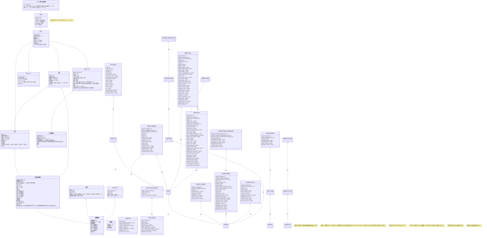

```mermaid
classDiagram
direction BT
    note "監査ログの項目、作成日時や更新日時は含めていない"

    class 医療機関 {
        医療機関ID PK
        医療機関コード（10桁）
        医療機関名
        住所（郵便番号）
        住所（都道府県）
        住所（市区町村）
        住所（丁目番地）
        住所（建物名）
        電話番号
    }
    医療機関 "1" -- "n" 患者基本情報

    class 医師 {
        医師ID : PK
        氏名（漢字）
        氏名（カナ）
        診療科ID : 診療所では複数になるのが一般的なので、配列または関連テーブル
        麻薬施用者番号 : 外来では不要
    }
    医療機関 "1" -- "1..n" 医師

    class コメディカル {
        コメディカルID : PK
        氏名（漢字）
        氏名（カナ）
        職種 : 看護師、事務員、etc
    }
    医療機関 "1" -- "0..n" コメディカル

    class 診療科 {
        診療科ID : PK
        診療科名
        診療科略名
    }

    class 患者基本情報 {
        患者基本情報ID : PK
        医療機関ID : FK
        患者ID : 患者番号、カルテ番号、診察券番号
        氏名（漢字）
        氏名（カナ）
        氏名（その他）
        性別
        生年月日
        住所（郵便番号）
        住所（都道府県）
        住所（市区町村）
        住所（丁目番地）
        住所（建物名）
        電話番号
        携帯番号
        死亡日時 TODO
        テスト患者フラグ
        患者サマリー
        移行先患者ID : TODO 業務上の誤り等で、同一人物に複数の患者IDが発行される場合がある。
    }
    患者基本情報 "1" -- "0..n" 受付
    患者基本情報 "1" -- "0..n" 予約

    class 予約 {
        予約ID : PK
        患者基本情報ID : FK
        医師ID : FK nullable
        診療科ID : FK nullable
        予約日時
        予約状態 : 予約済、受付済、キャンセルなど
        予約メモ
    }
    予約 "0..1" -- "0..1" カルテ

    class 受付 {
        受付ID : PK
        患者基本情報ID : FK
        予約ID : FK nullable
        医師ID : FK nullable
        診療科ID : FK
        受付日時
        受付番号
        受付状態 : 診察待ち、診察中、診察終了、会計終了、保留など
        受付メモ
    }
    受付 "1" -- "0..1" 予約
    受付 "1" -- "0..1" カルテ

    class カルテ {
        カルテID : PK
        患者基本情報ID : FK
        医師ID : FK
        診療科ID : FK
        受付ID : FK nullable
        予約ID : FK nullable
        診療年月日
        カルテ状態 : 仮保存、確定など
    }
    note for right of カルテ "予約ID : 予約時にオーダーを出すという要求を満たすのであれば必要になる。\nカルテなしでオーダーを出せるようにするのであればこの限りではない。"

    class SOAP {
        SOAP_ID : PK
        カルテID : FK
        Subjective : 主観的所見
        Objective : 客観的所見
        Assessment : 評価
        Plan : 治療方針
    }
    note for right of SOAP "要求に合わせてひとまずSOAPとした。"
    カルテ "1" -- "1" SOAP

    class シェーマ取り込み画像 {
        シェーマID : PK
        シェーマ名 : 選択したシェーマの名称または取り込んだ画像ファイル名
        内容 : フリーハンド入力等をした後のバイナリデータ
    }
    note for シェーマ取り込み画像 "要求に合わせてひとまずSOAPの子テーブルとした。"
    SOAP "1" -- "0..n" シェーマ取り込み画像

    class ドキュメント {
        ドキュメントID
        患者基本情報ID : FK
        カルテID : FK nullable
        ドキュメント名
        ドキュメント種別 : 分類を表す場合に使用
        MIMEタイプ
    }
    ドキュメント "0..n" -- "1" カルテ

    class 処方オーダー {
        処方オーダーID : PK
        カルテID : FK
        医師ID : FK
        オーダー日時
        処方区分 : 内服、頓服、外用
        定期・臨時
        院外・院内
        用法 : 1日3回食後、痛い時、1日2回8時間ごとなど
        日数・回数 : 内服・定期処方の場合は日数、それ以外は回数
        備考
        代行入力者ID : FK nullable
        承認状態 : 代行入力時の状態 承認済、未承認など
    }
    note for right of 処方オーダー "RPと同一の単位としたが、複数オーダーをまとめたい場合はこの限りではない。"
    note for right of 処方オーダー "用法は1回量での入力を前提とする。"
    note for right of 処方オーダー "院外処方では実施は記録しない。"
    処方オーダー "0..n" -- "1" カルテ

    class 処方医薬品 {
        処方医薬品ID : PK
        処方オーダーID : FK
        標準医薬品マスターコード : FK
        処方医薬品区分 : 一般名処方、後発品不可
        先発品区分 : 医師指定、患者希望 後発品不可の場合に指定する
        用量
        備考
    }
    処方医薬品 "1..n" -- "1" 処方オーダー

   class PATIENT_ALLERGIE {
       PATIENT_ALLERGIE_ID
       PATIENT_ALLERGIE_INITIAL_ID
       PATIENT_ID
       ALLERGIE_CODE : varchar
       START_YEAR_MONTH
       COMMENT1 : varchar
       REVISION_NUM : smallint
       LATEST_STATE : smallint
       REVISION_STATE : smallint
   }

   class PATIENT_BYOMEI {
       PATIENT_BYOMEI_ID
       PATIENT_BYOMEI_INITIAL_ID
       PATIENT_BYOMEI_PREVIOUS_ID
       PATIENT_ID
       FULL_BYOMEI : varchar
       BYOMEI : varchar
       BYOMEI_CODE
       ORCA_SINRYOKA_CODE : smallint
       ORCA_HOKEN_COMBI_NUM : smallint
       NYUGAI_KBN : smallint
       START_DATE
       TENKI_DATE
       TENKI_KBN : smallint
       SHUBYOMEI_FLAG : boolean
       UTAGAI_FLAG : boolean
       HOKEN_BYOMEI_FLAG : boolean
       PATIENT_BYOMEI_KBN : smallint
       SHUJUTSU_FLAG : boolean
       YUKETSU_FLAG : boolean
       COMMENT1 : varchar
       UNCODED_FLAG : boolean
       REVISION_NUM : smallint
       LATEST_STATE : smallint
       REVISION_STATE : smallint
   }

   class PATIENT_BYOMEI_SHUSHOKUGO {
       PATIENT_BYOMEI_SHUSHOKUGO_ID
       PATIENT_BYOMEI_SHUSHOKUGO_INITIAL_ID
       PATIENT_BYOMEI_SHUSHOKUGO_PREVIOUS_ID
       PATIENT_BYOMEI_ID
       SHUSHOKUGO_CODE : smallint
       SHUSHOKUGO_NAME : varchar
       SHUSHOKUGO_INDEX : smallint
       REVISION_NUM : smallint
       LATEST_STATE : smallint
       REVISION_STATE : smallint
   }

   class PATIENT_YAKUZAI {
       PATIENT_YAKUZAI_ID
       PATIENT_YAKUZAI_INITIAL_ID
       PATIENT_ID
       SINRYO_CODE
       SINRYO_NAME : varchar
       START_YEAR_MONTH
       USE_FLAG : boolean
       PATIENT_YAKUZAI_KBN : smallint
       COMMENT1 : varchar
       REVISION_NUM : smallint
       LATEST_STATE : smallint
       REVISION_STATE : smallint
   }

   class SINRYOKA {
       SINRYOKA_ID
       ORCA_SINRYOKA_CODE : smallint
       UKETSUKE_DOCTOR_ID
       CREATE_TIMESTAMP : timestamp
       CREATE_USER_ID
       UPDATE_TIMESTAMP : timestamp
       UPDATE_USER_ID
       VERSION_NO : smallint
   }

   class SINRYO_COMMENT {
       SINRYO_COMMENT_ID
       SINRYO_COMMENT_INITIAL_ID
       SINRYO_COMMENT_PREVIOUS_ID
       PATIENT_ID
       KARTE_ID
       PARENT_ID
       SINRYO_KBN : smallint
       NYUGAI_KBN : smallint
       CONTENT : varchar
       PARENT_KBN : smallint
       KARTE_DATE
       SINRYO_CODE
       COMMENT_INDEX : smallint
       APPROVED_FLAG : boolean
       REVISION_NUM : smallint
       LATEST_STATE : smallint
       REVISION_STATE : smallint
   }

   class SINRYO_ITEM {
       SINRYO_ITEM_ID
       SINRYO_ITEM_INITIAL_ID
       SINRYO_ITEM_PREVIOUS_ID
       PATIENT_ID
       TENSU_HOSPITAL_ID
       KARTE_ID
       SINRYO_UNIT_ID
       SINRYO_CODE
       SINRYO_NAME : varchar
       SINRYO_KANA_NAME : varchar
       NYUGAI_KBN : smallint
       SINRYO_KBN : smallint
       SINRYO_SHUBETSU_KBN : smallint
       SINRYO_ITEM_INDEX : smallint
       KARTE_DATE
       ORCA_INPUT_STATE : smallint
       TANI_CODE : smallint
       TENSU_KBN : smallint
       TENSU_DATA_KBN : smallint
       SINRYO_ITEM_PATTERN_ID
       SURYO : numeric
       REVISION_NUM : smallint
       LATEST_STATE : smallint
       REVISION_STATE : smallint
       FUKINTO_FLAG : boolean
       SURYO_KISHO : numeric
       SURYO_ASA : numeric
       SURYO_HIRU : numeric
       SURYO_YU : numeric
       SURYO_SHUSHIN : numeric
       KENSA_KBN : smallint
       ROSAI_KBN : smallint
       APPROVED_FLAG : boolean
       KENSA_CODE : varchar
       KENSA_KAISHA_ID
   }

   class SINRYO_UNIT {
       SINRYO_UNIT_ID
       SINRYO_UNIT_INITIAL_ID
       SINRYO_UNIT_PREVIOUS_ID
       KARTE_ID
       ORDER_KBN : smallint
       SINRYO_UNIT_TARGET_ID
       SINRYO_UNIT_ASSOCIATED_ID
       KARTE_DATETIME : bigint
       IRYO_KBN : smallint
       SINRYO_KBN : smallint
       SINRYO_SHUBETSU_KBN : smallint
       TEIKI_KBN : smallint
       TEIKI_CODE : smallint
       ORCA_SINRYOKA_CODE : smallint
       ORCA_HOKEN_COMBI_NUM : smallint
       SINRYO_UNIT_INDEX : smallint
       KAISU : smallint
       NISSU : smallint
       SANTEI_KBN : smallint
       RINJI_FLAG : boolean
       TAIIN_FLAG : boolean
       INNAI_INGAI_KBN : smallint
       ORDER_START_DATE
       ORDER_START_TIME_KBN : smallint
       ORDER_END_DATE
       ORDER_END_TIME_KBN : smallint
       SHUGI_NASHI_FLAG : boolean
       ZAITAKU_FLAG : boolean
       ZOEI_FLAG : boolean
       KENSA_KBN : smallint
       APPROVED_FLAG : boolean
       REVISION_NUM : smallint
       LATEST_STATE : smallint
       REVISION_STATE : smallint
       FULL_SINRYO_PATTERN_ID
       PLAIN_SINRYO_PATTERN_ID
   }

   class USER_ACCESS {
       USER_ACCESS_ID
       HOSPITAL_ID
       KARTE_USER_ID
       LOGIN_RESULT : smallint
       REMOTE_ADDRESS : varchar
       LOGIN_TIMESTAMP : timestamp
       LAST_ACCESS_TIMESTAMP : timestamp
       LOGOUT_TIMESTAMP : timestamp
       VERSION_NO : smallint
   }

   class USER_ACCESS_PATIENT {
       USER_ACCESS_PATIENT_ID
       USER_ACCESS_ID
       PATIENT_ID
       ACCESS_TIMESTAMP : timestamp
   }

   class USER_PRIVILEGE {
       USER_PRIVILEGE_ID
       USER_PRIVILEGE_INITIAL_ID
       KARTE_USER_ID
       PRIVILEGE_KBN : smallint
       REVISION_NUM : smallint
       LATEST_STATE : smallint
       REVISION_STATE : smallint
   }

   class VITAL_BODY {
       VITAL_ID
       VITAL_INITIAL_ID
       KARTE_KIJI_ID
       PATIENT_ID
       KARTE_DATE
       KARTE_TIME : smallint
       KETSUATSU_MAX : smallint
       KETSUATSU_MIN : smallint
       MYAKUHAKU : smallint
       TAION : numeric
       SPO2 : smallint
       TAIJU : numeric
       SINCHO : numeric
       FUKUI : numeric
       KYOI : numeric
       TOI : numeric
       REVISION_NUM : smallint
       LATEST_STATE : smallint
       REVISION_STATE : smallint
   }

   HOSPITAL  -->  KARTE_USER : has
   PATIENT  -->  KARTE : has
   PATIENT  -->  PATIENT_ALLERGIE : has
   PATIENT  -->  PATIENT_BYOMEI : has
   PATIENT  -->  PATIENT_YAKUZAI : has
   PATIENT  -->  UKETSUKE : has
   PATIENT_BYOMEI  -->  PATIENT_BYOMEI_SHUSHOKUGO : has
   KARTE  -->  UKETSUKE : has
   KARTE  -->  KARTE_KIJI : has
   KARTE  -->  SINRYO_COMMENT : has
   KARTE  -->  SINRYO_ITEM : has
   KARTE  -->  SINRYO_UNIT : has
   KARTE_KIJI  -->  VITAL_BODY : has
   KARTE_USER --> USER_PRIVILEGE : has
   SINRYO_SET --> SINRYO_SET_UNIT : has
   SINRYO_SET_UNIT --> SINRYO_SET_ITEM : has
   SINRYO_UNIT --> ORDER_ACCEPT : has
   SINRYO_UNIT --> SINRYO_ITEM : has
   UKETSUKE --> UKETSUKE_STATE : has
   UKETSUKE_STATE --> UKETSUKE_SINRYO_NAIYO : has
   USER_ACCESS --> USER_ACCESS_PATIENT : has

```
