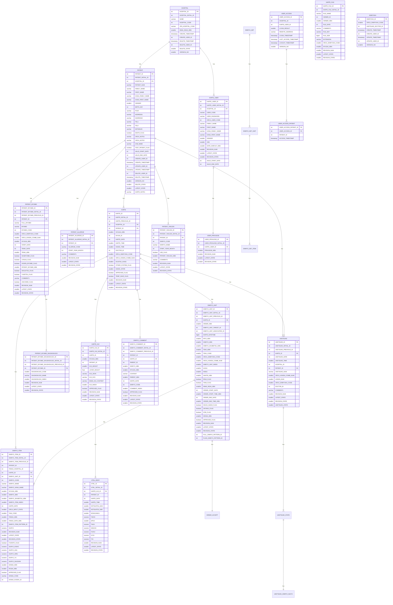

```mermaid
erDiagram
   HOSPITAL ||--|{ KARTE_USER : has
   HOSPITAL ||--|{ PATIENT : has
   PATIENT ||--|{ KARTE : has
   PATIENT ||--|{ PATIENT_ALLERGIE : has
   PATIENT ||--|{ PATIENT_BYOMEI : has
   PATIENT ||--|{ PATIENT_YAKUZAI : has
   PATIENT ||--|{ UKETSUKE : has
   PATIENT_BYOMEI ||--|{ PATIENT_BYOMEI_SHUSHOKUGO : has
   KARTE ||--|{ UKETSUKE : has
   KARTE ||--|{ KARTE_KIJI : has
   KARTE ||--|{ SINRYO_COMMENT : has
   KARTE ||--|{ SINRYO_ITEM : has
   KARTE ||--|{ SINRYO_UNIT : has
   KARTE_KIJI ||--|{ VITAL_BODY : has
   KARTE_USER }|--|| USER_PRIVILEGE : has
   SINRYO_SET ||--|{ SINRYO_SET_UNIT : has
   SINRYO_SET_UNIT ||--|{ SINRYO_SET_ITEM : has
   SINRYO_UNIT ||--|| ORDER_ACCEPT : has
   SINRYO_UNIT ||--|{ SINRYO_ITEM : has
   UKETSUKE ||--|{ UKETSUKE_STATE : has
   UKETSUKE_STATE ||--|| UKETSUKE_SINRYO_NAIYO : has
   USER_ACCESS ||--|{ USER_ACCESS_PATIENT : has

   HOSPITAL {
       int HOSPITAL_ID PK
       int HOSPITAL_INITIAL_ID
       varchar NAME
       int HOSPITAL_CODE
       varchar JPN_HOSPITAL_CODE
       smallint INNAI_INGAI_KBN
       timestamp CREATE_TIMESTAMP
       int CREATE_USER_ID
       timestamp DELETE_TIMESTAMP
       int DELETE_USER_ID
       smallint DELETE_STATE
       smallint VERSION_NO
   }

   KARTE {
       int KARTE_ID PK
       int KARTE_INITIAL_ID
       int KARTE_PREVIOUS_ID
       int HOSPITAL_ID FK
       int PATIENT_ID FK
       smallint NYUGAI_KBN
       int NYUIN_ID
       int KARTE_DATE
       smallint KARTE_TIME
       smallint KAIKEI_TIME 
       int DOCTOR_ID
       smallint ORCA_SINRYOKA_CODE
       smallint ORCA_HOKEN_COMBI_NUM
       smallint DOJITSU_KAISU
       boolean OTHER_SYSTEM_FLAG
       smallint KAIKEI_STATE
       boolean APPROVED_FLAG
       boolean TEMP_SAVE_FLAG
       smallint REVISION_NUM
       smallint LATEST_STATE
       smallint REVISION_STATE
   }

   KARTE_FILE {
       int KARTE_FILE_ID PK
       int KARTE_FILE_INITIAL_ID
       varchar FILE_NAME
       int OWNER_ID
       smallint OWNER_KBN
       int FILE_DATE
       varchar COMMENT1
       varchar FILE_KEY
       bigint FILE_SIZE
       varchar EXTENSION
       smallint ORCA_SINRYOKA_CODE
       smallint NYUGAI_KBN
       smallint REVISION_NUM
       smallint LATEST_STATE
       smallint REVISION_STATE
   }

   KARTE_KIJI {
       int KARTE_KIJI_ID PK
       int KARTE_KIJI_INITIAL_ID
       int KARTE_ID FK
       smallint NYUGAI_KBN
       int PATIENT_ID
       smallint KIJI_HEIGHT
       float LAYER_HEIGHT
       varchar KIJI_JSON
       varchar KIJI_SVG
       varchar BASE_KIJI_CONTENT
       smallint KIJI_INDEX
       boolean APPROVED_FLAG
       smallint REVISION_NUM
       smallint LATEST_STATE
       smallint REVISION_STATE
   }

   KARTE_USER {
       int KARTE_USER_ID PK
       int KARTE_USER_INITIAL_ID
       int HOSPITAL_ID FK
       varchar USER_CODE
       varchar USER_PASSWORD
       int ORCA_USER_CODE
       varchar FAMILY_NAME
       varchar FIRST_NAME
       varchar KANA_FAMILY_NAME
       varchar KANA_FIRST_NAME
       smallint GENDER
       smallint JOB
       smallint DATE_DISPLAY_KBN
       smallint REVISION_NUM
       smallint LATEST_STATE
       smallint REVISION_STATE
       int VALID_START_DATE
       int VALID_END_DATE
   }

   PATIENT {
       int PATIENT_ID PK
       int PATIENT_INITIAL_ID
       int HOSPITAL_ID FK
       varchar PATIENT_NUM
       varchar FAMILY_NAME
       varchar FIRST_NAME
       varchar KANA_FAMILY_NAME
       varchar KANA_FIRST_NAME
       smallint GENDER
       int BIRTH_DAY
       varchar POST
       varchar ADDRESS1
       varchar ADDRESS2
       varchar TEL1
       varchar TEL2
       varchar SETAINUSI
       boolean DEATH_FLAG
       varchar ORCA_NOTE1
       varchar ORCA_NOTE2
       varchar JOB_NAME
       boolean TEST_PATIENT_FLAG
       int VALID_START_DATE
       int VALID_END_DATE
       int CREATE_USER_ID
       timestamp CREATE_TIMESTAMP
       int UPDATE_USER_ID
       timestamp UPDATE_TIMESTAMP
       int DELETE_USER_ID
       timestamp DELETE_TIMESTAMP
       smallint VERSION_NO
       smallint DELETE_STATE
       smallint LATEST_STATE
       varchar KARTE_NOTE1
   }

   PATIENT_ALLERGIE {
       int PATIENT_ALLERGIE_ID PK
       int PATIENT_ALLERGIE_INITIAL_ID
       int PATIENT_ID FK
       varchar ALLERGIE_CODE
       int START_YEAR_MONTH
       varchar COMMENT1
       smallint REVISION_NUM
       smallint LATEST_STATE
       smallint REVISION_STATE
   }

   PATIENT_BYOMEI {
       int PATIENT_BYOMEI_ID PK
       int PATIENT_BYOMEI_INITIAL_ID
       int PATIENT_BYOMEI_PREVIOUS_ID
       int PATIENT_ID FK
       varchar FULL_BYOMEI
       varchar BYOMEI
       int BYOMEI_CODE
       smallint ORCA_SINRYOKA_CODE
       smallint ORCA_HOKEN_COMBI_NUM
       smallint NYUGAI_KBN
       int START_DATE
       int TENKI_DATE
       smallint TENKI_KBN
       boolean SHUBYOMEI_FLAG
       boolean UTAGAI_FLAG
       boolean HOKEN_BYOMEI_FLAG
       smallint PATIENT_BYOMEI_KBN
       boolean SHUJUTSU_FLAG
       boolean YUKETSU_FLAG
       varchar COMMENT1
       boolean UNCODED_FLAG
       smallint REVISION_NUM
       smallint LATEST_STATE
       smallint REVISION_STATE
   }

   PATIENT_BYOMEI_SHUSHOKUGO {
       int PATIENT_BYOMEI_SHUSHOKUGO_ID PK
       int PATIENT_BYOMEI_SHUSHOKUGO_INITIAL_ID
       int PATIENT_BYOMEI_SHUSHOKUGO_PREVIOUS_ID
       int PATIENT_BYOMEI_ID FK
       smallint SHUSHOKUGO_CODE
       varchar SHUSHOKUGO_NAME
       smallint SHUSHOKUGO_INDEX
       smallint REVISION_NUM
       smallint LATEST_STATE
       smallint REVISION_STATE
   }

   PATIENT_YAKUZAI {
       int PATIENT_YAKUZAI_ID PK
       int PATIENT_YAKUZAI_INITIAL_ID
       int PATIENT_ID FK
       int SINRYO_CODE
       varchar SINRYO_NAME  
       int START_YEAR_MONTH
       boolean USE_FLAG
       smallint PATIENT_YAKUZAI_KBN
       varchar COMMENT1
       smallint REVISION_NUM
       smallint LATEST_STATE
       smallint REVISION_STATE
   }

   SINRYOKA {
       int SINRYOKA_ID PK
       smallint ORCA_SINRYOKA_CODE
       int UKETSUKE_DOCTOR_ID
       timestamp CREATE_TIMESTAMP
       int CREATE_USER_ID
       timestamp UPDATE_TIMESTAMP
       int UPDATE_USER_ID
       smallint VERSION_NO
   }

   SINRYO_COMMENT {
       int SINRYO_COMMENT_ID PK
       int SINRYO_COMMENT_INITIAL_ID
       int SINRYO_COMMENT_PREVIOUS_ID
       int PATIENT_ID
       int KARTE_ID FK
       int PARENT_ID
       smallint SINRYO_KBN
       smallint NYUGAI_KBN
       varchar CONTENT
       smallint PARENT_KBN
       int KARTE_DATE
       int SINRYO_CODE
       smallint COMMENT_INDEX
       boolean APPROVED_FLAG
       smallint REVISION_NUM  
       smallint LATEST_STATE
       smallint REVISION_STATE
   }

   SINRYO_ITEM {
       int SINRYO_ITEM_ID PK  
       int SINRYO_ITEM_INITIAL_ID
       int SINRYO_ITEM_PREVIOUS_ID
       int PATIENT_ID
       int TENSU_HOSPITAL_ID
       int KARTE_ID FK
       int SINRYO_UNIT_ID FK
       int SINRYO_CODE
       varchar SINRYO_NAME
       varchar SINRYO_KANA_NAME
       smallint NYUGAI_KBN 
       smallint SINRYO_KBN
       smallint SINRYO_SHUBETSU_KBN
       smallint SINRYO_ITEM_INDEX
       int KARTE_DATE
       smallint ORCA_INPUT_STATE
       smallint TANI_CODE
       smallint TENSU_KBN
       smallint TENSU_DATA_KBN
       int SINRYO_ITEM_PATTERN_ID
       numeric SURYO  
       smallint REVISION_NUM
       smallint LATEST_STATE
       smallint REVISION_STATE
       boolean FUKINTO_FLAG
       numeric SURYO_KISHO
       numeric SURYO_ASA
       numeric SURYO_HIRU
       numeric SURYO_YU
       numeric SURYO_SHUSHIN
       smallint KENSA_KBN
       smallint ROSAI_KBN
       boolean APPROVED_FLAG
       varchar KENSA_CODE
       int KENSA_KAISHA_ID
   }

   SINRYO_UNIT {
       int SINRYO_UNIT_ID PK
       int SINRYO_UNIT_INITIAL_ID
       int SINRYO_UNIT_PREVIOUS_ID
       int KARTE_ID FK
       smallint ORDER_KBN 
       int SINRYO_UNIT_TARGET_ID
       int SINRYO_UNIT_ASSOCIATED_ID
       bigint KARTE_DATETIME
       smallint IRYO_KBN
       smallint SINRYO_KBN
       smallint SINRYO_SHUBETSU_KBN
       smallint TEIKI_KBN
       smallint TEIKI_CODE
       smallint ORCA_SINRYOKA_CODE
       smallint ORCA_HOKEN_COMBI_NUM
       smallint SINRYO_UNIT_INDEX
       smallint KAISU
       smallint NISSU
       smallint SANTEI_KBN
       boolean RINJI_FLAG
       boolean TAIIN_FLAG
       smallint INNAI_INGAI_KBN
       int ORDER_START_DATE
       smallint ORDER_START_TIME_KBN
       int ORDER_END_DATE
       smallint ORDER_END_TIME_KBN
       boolean SHUGI_NASHI_FLAG
       boolean ZAITAKU_FLAG
       boolean ZOEI_FLAG
       smallint KENSA_KBN
       boolean APPROVED_FLAG
       smallint REVISION_NUM
       smallint LATEST_STATE
       smallint REVISION_STATE
       int FULL_SINRYO_PATTERN_ID
       int PLAIN_SINRYO_PATTERN_ID
   }
   
   UKETSUKE {
       int UKETSUKE_ID PK
       int UKETSUKE_INITIAL_ID
       int UKETSUKE_PREVIOUS_ID
       int KARTE_ID FK
       int UKETSUKE_DATE
       smallint UKETSUKE_TIME
       int HOSPITAL_ID
       int PATIENT_ID FK
       varchar UKETSUKE_NUM
       smallint ORCA_HOKEN_COMBI_NUM  
       smallint HOKEN_NUM
       smallint ORCA_SINRYOKA_CODE
       int DOCTOR_ID
       varchar COMMENT1
       smallint REVISION_NUM
       smallint LATEST_STATE
       smallint REVISION_STATE
       smallint UKETSUKE_STATE
   }

   USER_ACCESS {
       int USER_ACCESS_ID PK  
       int HOSPITAL_ID
       int KARTE_USER_ID
       smallint LOGIN_RESULT
       varchar REMOTE_ADDRESS
       timestamp LOGIN_TIMESTAMP
       timestamp LAST_ACCESS_TIMESTAMP
       timestamp LOGOUT_TIMESTAMP  
       smallint VERSION_NO
   }

   USER_ACCESS_PATIENT {
       int USER_ACCESS_PATIENT_ID PK
       int USER_ACCESS_ID FK
       int PATIENT_ID  
       timestamp ACCESS_TIMESTAMP
   }

   USER_PRIVILEGE {
       int USER_PRIVILEGE_ID PK
       int USER_PRIVILEGE_INITIAL_ID
       int KARTE_USER_ID FK
       smallint PRIVILEGE_KBN
       smallint REVISION_NUM
       smallint LATEST_STATE
       smallint REVISION_STATE  
   }

   VITAL_BODY {
       int VITAL_ID PK
       int VITAL_INITIAL_ID
       int KARTE_KIJI_ID FK
       int PATIENT_ID
       int KARTE_DATE
       smallint KARTE_TIME
       smallint KETSUATSU_MAX
       smallint KETSUATSU_MIN
       smallint MYAKUHAKU
       numeric TAION
       smallint SPO2
       numeric TAIJU  
       numeric SINCHO
       numeric FUKUI
       numeric KYOI
       numeric TOI
       smallint REVISION_NUM
       smallint LATEST_STATE
       smallint REVISION_STATE
   }
```