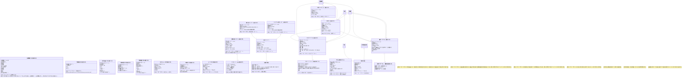

```mermaid
classDiagram
direction BT
    note "除外: デジ庁データモデル・後発医薬品リスト 一般名処方にすれば加算が取れるかはレセプト電産処理システム医薬品マスタに項目があり判定が可能"
    note "除外: デジ庁データモデル・医薬品情報文書類 おそらく医薬品添付文書および薬剤情報提供書用の情報を指している。電カル単体で持つならサードパーティのマスタが必要になる"
    note "除外: デジ庁データモデル・併用禁忌 電子処方箋管理サービスの機能を使うかにもより、電カル単体で持つならサードパーティのマスタが必要になる"
    note "除外: デジ庁データモデル・投与方法 処方の投与方法なので、用法コメントマスタに内包される想定"
    note "除外: 処置注射関連 初期スコープは処方と検査のみ"
    note "除外: 加算情報、レセ請求履歴 レセコンとの責務が明確ではない"
    note "履歴関連: 処方オーダー履歴、検査オーダー履歴は具象のエンティティと同一のものが記録される"

    class 医療機関マスタ["医療機関マスタ(共通マスタ)"] {
        医療機関コード PK 7桁
        医療機関名称
        都道府県コード
        郵便番号
        市区町村
        住所（丁目番地）
        住所（建物名）
        電話番号
        開設者名
        開設日
        閉鎖日
        移行先医療機関コード
        対応("デジ庁データモデル・医療機関マスタ")
        補足("マスタ管理のコストが増えるので不要と考えるが、デジ庁に合わせて定義した。医療機関コード、医療機関名がセットで扱われるのでマスタである必要はない。")
    }

    class 予防接種マスタ["予防接種マスタ(共通マスタ)"] {
        予防接種マスタコード
        予防接種名称
        HOT9
        HOT13
        YJコード
        対応("デジ庁データモデル・予防接種マスタ")
        参考("https://jpfhir.jp/fhir/core/1.1.1/StructureDefinition-jp-immunization.html")
    }

    class 標準医薬品マスタ["標準医薬品マスタ(共通マスタ)"] {
        標準医薬品マスタコード PK
        医薬品名称
        医薬品カナ名称
        HOT9
        HOT13
        一般名コード
        YJコード
        薬価基準コード
        レセプト電産・医薬品コード
    }

    class 自院用検査マスタ["自院用検査マスタ(医院マスタ)"] {
        自院用検査マスタコード PK
        検査名称
        検査カナ名称
        標準検査マスタコード FK
        外注検査会社ID
        外注検査会社・検査コード
    }

    class 標準検査マスタ["標準検査マスタ(共通マスタ)"] {
        標準検査マスタコード PK
        検査名称
        検査カナ名称
        標準病名交換コード
        HOT9
        HOT13
        一般名コード
        YJコード
        薬価基準コード
        レセプト電産・医薬品コード
    }

    class 用法コメントマスタ["用法コメントマスタ(医院マスタ)"] {
        用法コメントマスタコード PK
        医療機関ID FK
        医師ID FK nullable
        診療科ID FK nullable
        JAMI用法コード
        用法名称
        対応("デジ庁データモデル・用法コメントマスタ")
    }

    class 採用薬マスタ["採用薬マスタ(医院マスタ)"] {
        採用薬マスタコード PK
        医療機関ID FK
        診療科ID FK nullable
        標準医薬品マスタコード FK
        対応("デジ庁データモデル・採用薬マスタ")
        補足("医師IDは除外")
    }

    class シェーママスタ["シェーママスタ(医院マスタ)"] {
        シェーママスタコード PK
        医療機関ID FK
        診療科ID FK nullable
        シェーマ名称
        シェーマ分類
        保存先 クラウドストレージのURL等
        対応("デジ庁データモデル・シェーママスタ")
    }

    class 汎用セットカテゴリー["汎用セットカテゴリー(医院マスタ)"] {
        汎用セットカテゴリーID PK
        医療機関ID FK
        医師ID FK nullable
        診療科ID FK nullable
        カテゴリー名称
        対応("デジ庁データモデル・汎用セットカテゴリー")
    }
    汎用セットカテゴリー "0..n" -- "1" 医療機関

    class 診療記録テンプレート["診療記録テンプレート(医院マスタ)"] {
        診療記録テンプレートID PK
        医療機関ID FK
        医師ID FK nullable
        診療科ID FK nullable
        テンプレート名称
        汎用セットID[] FK
        処方オーダーセットID[] FK
        検査オーダーセットID[] FK
        対応("デジ庁データモデル・診療記録テンプレート")
        補足("カルテの規定の下書きというイメージ")
    }

    class テンプレートSOAP["テンプレート・SOAP(医院マスタ)"] {
        テンプレートSOAPID PK
        診療記録テンプレートID FK
        Subjective : 主観的所見
        Objective : 客観的所見
        Assessment : 評価
        Plan : 治療方針
        補足("SOAP各項目に既定の文字列を設定する")
    }
    テンプレートSOAP "0..n" -- "1" 診療記録テンプレート

    class 汎用セット["汎用セット(医院マスタ)"] {
        汎用オーダーセットID PK
        汎用セットカテゴリーID FK
        医療機関ID FK
        医師ID FK nullable
        診療科ID FK nullable
        セット名称
        処方オーダーセットID[] FK
        検査オーダーセットID[] FK
        対応("デジ庁データモデル・汎用セット")
    }
    汎用セット "1..n" -- "1" 汎用セットカテゴリー
    汎用セット "0..n" -- "1" 医療機関
    汎用セット "0..n" -- "1" 医師
    汎用セット "0..n" -- "1" 診療科

    class 処方オーダーセット["処方オーダーセット(医院マスタ)"] {
        処方オーダーセットID PK
        医療機関ID FK
        医師ID FK nullable
        診療科ID FK nullable
        セット名称
        処方区分 : 内服、頓服、外用
        定期・臨時
        院外・院内
        用法コメントマスタコード
        日数・回数 : 内服・定期処方の場合は日数、それ以外は回数
        備考
        対応("デジ庁データモデル・処方オーダーセット")
    }
    処方オーダーセット "0..n" -- "1" 汎用セット
    処方オーダーセット "0..n" -- "1" 医療機関
    処方オーダーセット "0..n" -- "1" 医師
    処方オーダーセット "0..n" -- "1" 診療科

    class 処方オーダーセット医薬品["処方オーダーセット・医薬品(医院マスタ)"] {
        処方オーダーセット医薬品 FK
        処方オーダーセットID FK
        標準医薬品マスターコード
        処方医薬品区分 : 一般名処方、変更不可（先発品指定）
        先発品区分 : 医師指定、患者希望 後発品不可の場合に指定する
        用量
        備考
        コメント("単位はマスターから取得する。")
    }
    処方オーダーセット医薬品 "1..n" -- "1" 処方オーダーセット

    class 検査オーダーセット["検査オーダーセット(医院マスタ)"] {
        検査オーダーセットID : PK
        医療機関ID FK
        医師ID FK nullable
        診療科ID FK nullable
        セット名称
        検査区分 : 検体検査（生化学、血液学など）、生理検査など
        優先度 : 通常、至急など
        外注検査会社ID
        備考
    }
    検査オーダーセット "0..n" -- "1" 汎用セット
    検査オーダーセット "0..n" -- "1" 医療機関
    検査オーダーセット "0..n" -- "1" 医師
    検査オーダーセット "0..n" -- "1" 診療科

    class 検査オーダーセット検査項目["検査オーダーセット・検査項目(医院マスタ)"] {
        検査オーダーセット検査項目ID : PK
        検査オーダーセットID FK
        自院用検査マスタコード nullable
        標準検査マスターコード nullable
    }
    検査オーダーセット検査項目  "1..n" -- "1" 検査オーダーセット

    class 代行入力承認リクエスト["代行入力承認リクエスト"] {
        代行入力承認リクエストID PK
        医療機関ID FK
        医師ID FK
        代行入力者ID FK
        代行入力日時
        リクエストコメント
        ステータス : 未承認、承認済み、却下
        承認日時
        承認コメント
        対応("デジ庁データモデル・代理入力リクエスト")
        内包("デジ庁データモデル・代理入力承認履歴")
    }

    class 作成済み文書["作成済み文書"] {
        作成済み文書ID PK
        医療機関ID FK
        患者ID FK
        医師ID FK nullable
        診療科ID FK nullable
        作成日時
        文書タイトル
        保存先 クラウドストレージのURL等
        対応("デジ庁データモデル・作成済み文書")
    }
    作成済み文書 "0..n" -- "1" 患者
    作成済み文書 "0..1" -- "0..1" 診療情報提供書

    class 文書テンプレート["文書テンプレート"] {
        文書テンプレートID PK
        医療機関ID FK
        診療科ID FK nullable
        文書タイトル
        テンプレート名称
        規定文書テンプレートID FK nullable
        オリジナル文書テンプレートIF FK nullable
        対応("デジ庁データモデル・文書テンプレート")
    }
    文書テンプレート "1" -- "0..1" 規定文書テンプレート
    文書テンプレート "1" -- "0..1" オリジナル文書テンプレート

    class 自動入力箇所["自動入力箇所"] {
        自動入力箇所ID PK
        文書テンプレートID FK
        自動入力プレースホルダー テンプレートのJSON等で置き換え対象となる文字列
        自動入力区分 患者情報、医師情報等を区分値とする
        自動入力内容 nullable 任意の文字列
        対応("デジ庁データモデル・自動入力箇所")
    }
    自動入力箇所 "0..n" -- "1" 文書テンプレート

    class 規定文書テンプレート["規定文書テンプレート(共通マスタ)"] {
        規定文書テンプレートID PK
        診療科ID FK nullable
        文書区分 要件定義書に記載の規定文書を区分値とする
        文書タイトル
        テンプレート内容 JSON等の文書構造を想定
        対応("デジ庁データモデル・規定文書テンプレート")
    }

    class オリジナル文書テンプレート["オリジナル文書テンプレート(医院マスタ)"] {
        オリジナル文書テンプレートID PK
        医療機関ID FK
        診療科ID FK nullable
        文書タイトル
        テンプレート名称
        テンプレート内容 JSON等の文書構造を想定
        対応("デジ庁データモデル・オリジナル文書テンプレート")
    }
```
