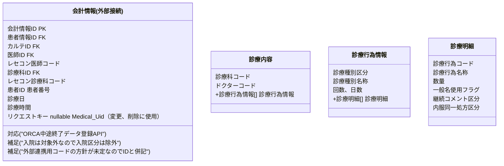

```mermaid
classDiagram
direction TB

    class 会計情報["会計情報(外部接続)"] {
        会計情報ID PK
        患者情報ID FK
        カルテID FK
        医師ID FK
        レセコン医師コード
        診療科ID FK
        レセコン診療科コード
        患者ID 患者番号
        診療日
        診療時間
        リクエストキー nullable Medical_Uid（変更、削除に使用）
        対応("ORCA中途終了データ登録API")
        補足("入院は対象外なので入院区分は除外")
        補足("外部連携用コードの方針が未定なのでIDと併記")
    }

    class 診療内容 {
        診療科コード
        ドクターコード
        +診療行為情報[] 診療行為情報
    }

    class 診療行為情報 {
        診療種別区分
        診療種別名称
        回数、日数
        +診療明細[] 診療明細
    }

    class 診療明細 {
        診療行為コード
        診療行為名称
        数量
        一般名使用フラグ
        継続コメント区分
        内服同一処方区分
    }
```
