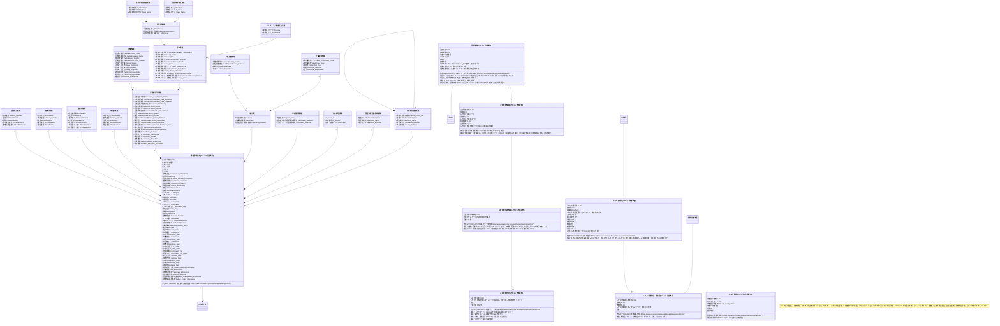

```mermaid
classDiagram
direction BT
note "「レセ請求履歴」「加算情報」は除外。中途終了は「下書き」なので、レスポンスを取得しても厳密には「履歴」にならない。一旦はリクエストだけを対象とする。HAORIであれば登録できるということであれば、保険・公費の負担割合、固定上限額、加算内容が返るだけでほぼリクエストと同一。"

   class 患者基本情報["患者基本情報(レセコン外部接続)"] {
        患者基本情報ID PK
        患者ID 患者番号
        氏名（漢字）
        氏名（カナ）
        生年月日
        性別 Sex
       +世帯主名 HouseHolder_WholeName
       +続柄 Relationship
       +自宅住所情報 Home_Address_Information
       +勤務先情報 WorkPlace_Information
       +連絡先情報 Contact_Information
       +帰省先情報 Home2_Information
       +禁忌１ Contraindication1
       +禁忌２ Contraindication2
       +アレルギー１ Allergy1
       +アレルギー２ Allergy2
       +感染症１ Infection1
       +感染症２ Infection2
       +コメント１ Comment1
       +コメント２ Comment2
       +テスト患者区分 TestPatient_Flag
       +死亡区分 Death_Flag
       +職業 Occupation
       +通称名 NickName
       +携帯電話番号 CellularNumber
       +ＦＡＸ番号 FaxNumber
       +電子メールアドレス EmailAddress
       +減免事由番号 Reduction_Reason
       +減免事由 Reduction_Reason_Name
       +割引率 Discount
       +割引率 Discount_Name
       +状態番号１ Condition1
       +状態１ Condition1_Name
       +状態番号２ Condition2
       +状態２ Condition2_Name
       +状態番号３ Condition3
       +状態３ Condition3_Name
       +入金方法区分 Ic_Code
       +入金方法 Ic_Code_Name
       +地域連携ID Community_Cid
       +同意フラグ Community_Cid_Agree
       +初回受診日 FirstVisit_Date
       +最終受診日 LastVisit_Date
       +入院中 Outpatient_Class
       +入院日 Admission_Date
       +退院日 Discharge_Date
       +保険組合せ情報 HealthInsurance_Information
       +介護情報 Care_Information
       +患者個別情報 Personally_Information
       +個人番号情報 Individual_Number
       +管理料等自動算定情報 Auto_Management_Information
       +患者禁忌薬剤情報 Patient_Contra_Information
       外部API("ORCA API 患者基本情報の取得 https://www.orca.med.or.jp/receipt/tec/api/patientget.html")
   }

   class 自宅住所情報 {
       +郵便番号 Address_ZipCode
       +住所1 WholeAddress1
       +住所2 WholeAddress2
       +自宅電話番号 PhoneNumber1
       +連絡先電話番号 PhoneNumber2
   }

   class 勤務先情報 {
       +勤務先名 WholeName
       +郵便番号 Address_ZipCode
       +住所 WholeAddress1
       +番地番号 WholeAddress2
       +電話番号 PhoneNumber
   }

   class 連絡先情報 {
       +連絡先名称 WholeName
       +続柄 Relationship
       +郵便番号 Address_ZipCode
       +住所 WholeAddress1
       +番地番号 WholeAddress2
       +電話番号（昼） PhoneNumber1
       +電話番号（夜） PhoneNumber2
   }

   class 帰省先情報 {
       +帰省先名称 WholeName
       +郵便番号 Address_ZipCode
       +住所 WholeAddress1
       +番地番号 WholeAddress2
       +電話番号 PhoneNumber
   }

   class 保険組合せ情報 {
       +保険組合せ番号 Insurance_Combination_Number
       +入院負担割合 InsuranceCombination_Rate_Admission
       +外来負担割合 InsuranceCombination_Rate_Outpatient
       +保険組合せ非表示区分 Insurance_Nondisplay
       +保険の種類 InsuranceProvider_Class
       +保険者番号 InsuranceProvider_Number
       +保険の制度名称 InsuranceProvider_WholeName
       +記号 HealthInsuredPerson_Symbol
       +番号 HealthInsuredPerson_Number
       +枝番 HealthInsuredPerson_Branch_Number
       +継続区分 HealthInsuredPerson_Continuation
       +補助区分 HealthInsuredPerson_Assistance
       +補助区分名称 HealthInsuredPerson_Assistance_Name
       +本人家族区分 RelationToInsuredPerson
       +被保険者名 HealthInsuredPerson_WholeName
       +適用開始日 Certificate_StartDate
       +適用終了日 Certificate_ExpiredDate
       +資格取得日 Certificate_GetDate
       +最終確認日 Insurance_CheckDate
       +公費情報 PublicInsurance_Information
       +労災情報 Accident_Insurance_Information
   }

   class 公費情報 {
       +公費の種類 PublicInsurance_Class
       +公費の種類名称 PublicInsurance_Name
       +負担者番号 PublicInsurer_Number
       +受給者番号 PublicInsuredPerson_Number
       +入院ー負担率 Rate_Admission
       +入院ー固定額 Money_Admission
       +外来ー負担率 Rate_Outpatient
       +外来ー固定額 Money_Outpatient
       +適用開始日 Certificate_IssuedDate
       +適用終了日 Certificate_ExpiredDate
       +確認日付 Certificate_CheckDate
   }

   class 労災情報 {
       +労災自賠保険区分 Accident_Insurance_WholeName
       +傷病の部位 Disease_Location
       +傷病年月日 Disease_Date
       +労働保険番号 Accident_Insurance_Number
       +年金証書番号 PensionCertificate_Number
       +災害区分 Accident_Class
       +労働基準監督署コード Labor_Station_Code
       +労働基準監督署 Labor_Station_Code_Name
       +事業所情報 Liability_Office_Information
       +自賠責保険会社名 Liability_Insurance_Office_Name
       +アフターケア　健康管理手帳番号 PersonalHealthRecord_Number
       +アフターケア　損傷区分情報 Damage_Class
   }

   class 事業所情報 {
       +事業所名称 L_WholeName
       +所在地都道府県情報 Prefecture_Information
       +所在地郡市区情報 City_Information
   }

   class 所在地都道府県情報 {
       +都道府県名 P_WholeName
       +都道府県コード P_Class
       +都道府県の区分 P_Class_Name
   }

   class 所在地郡市区情報 {
       +郡市区名 C_WholeName
       +郡市区コード C_Class
       +郡市の区分 C_Class_Name
   }

   class アフターケア損傷区分情報 {
       +損傷区分コード D_Code
       +損傷区分 D_WholeName
   }

   class 介護情報 {
       +介護保険情報 Insurance
       +介護認定情報 Certification
       +地域包括診療対象疾病 Community_Disease
   }

   class 介護保険情報 {
       +保険者番号 InsuranceProvider_Number
       +被保険者番号 HealthInsuredPerson_Number
       +開始 Certificate_StartDate
       +終了 Certificate_ExpiredDate
   }

   class 介護認定情報 {
       +要介護状態コード Need_Care_State_Code
       +要介護状態 Need_Care_State
       +認定日 Certification_Date
       +開始 Certificate_StartDate
       +終了 Certificate_ExpiredDate
   }

   class 患者個別情報 {
       +妊婦区分 Pregnant_Class
       +認知症地域包括診療加算算定 Community_Disease2
       +小児かかりつけ診療料算定 Community_Disease3
   }

   class 個人番号情報 {
       +Id_key In_Id
       +個人番号 In_Number
       +備考（説明） In_Description
   }

   class 管理料等自動算定情報 {
       +管理料コード Medication_Code
       +管理料名称 Medication_Name
       +有効終了日 Medication_EndDate
   }

   class 患者禁忌薬剤情報 {
       +患者禁忌薬剤情報 Patient_Contra_Info
   }

   class 患者禁忌薬剤情報 {
       +薬剤コード Medication_Code
       +薬剤名称 Medication_Name
       +有効終了日 Medication_EndDate
       +禁忌開始日 Contra_StartDate
   }

   レスポンス "1" *-- "1" 患者基本情報
   患者基本情報 "1" *-- "1" 自宅住所情報
   患者基本情報 "1" *-- "1" 勤務先情報
   患者基本情報 "1" *-- "1" 連絡先情報
   患者基本情報 "1" *-- "1" 帰省先情報
   患者基本情報 "1" *-- "20" 保険組合せ情報
   患者基本情報 "1" *-- "1" 介護情報
   患者基本情報 "1" *-- "1" 患者個別情報
   患者基本情報 "1" *-- "20" 個人番号情報
   患者基本情報 "1" *-- "3" 管理料等自動算定情報
   患者基本情報 "1" *-- "1" 患者禁忌薬剤情報
   保険組合せ情報 "1" *-- "4" 公費情報
   保険組合せ情報 "1" *-- "1" 労災情報
   労災情報 "1" *-- "1" 事業所情報
   労災情報 "1" *-- "1" アフターケア損傷区分情報
   事業所情報 "1" *-- "1" 所在地都道府県情報
   事業所情報 "1" *-- "1" 所在地郡市区情報
   介護情報 "1" *-- "10" 介護保険情報
   介護情報 "1" *-- "50" 介護認定情報
   患者禁忌薬剤情報 "1" *-- "100" 患者禁忌薬剤情報

    class 会計情報["会計情報(レセコン外部接続)"] {
        会計情報ID PK
        患者情報ID FK
        患者ID 患者番号
        カルテID[] FK
        診療日
        診療時間
        リクエストキー（ORCA Medical_Uid 変更、削除に使用）
        連携日時 レセコン連携を行なった日時
        連携結果 成功、失敗などレセコンの連携結果を保持する
        外部API("ORCA API 中途終了データ作成 https://www.orca.med.or.jp/receipt/tec/api/medicalmod.html")
        補足("カルテとのリレーションはORCA APIの粒度と合わせたがレセコンにより異なることが想定される")
        補足("入院は対象外なので入院・外来区分は対象外")
        補足("電カルとレセコンの患者番号が一致する前提")
        補足("診療日、診療日時はORCAと合わせたがカルテn個に対してなので何を送るかは要検討")
    }
    カルテ "1..n" -- "0..1" 会計情報

    class 会計診療情報["会計診療情報(レセコン外部接続)"] {
        会計診療情報ID PK
        医師ID FK
        レセコン医師コード
        診療科ID FK
        レセコン診療科コード
        保険情報ID FK
        公費情報ID[] FK
        レセコン患者保険コード ORCA保険組合せ番号
        補足("医師等は外部連携用コードの方針が未定なのでIDと併記")
        補足("保険情報・公費情報は、レセコン用保険コード（ORCAだと保険組合せ番号）または保険情報・公費情報を送ることを想定")
    }
    会計診療情報 "1..n" -- "1" 会計情報

    class 会計診療行為情報["会計診療行為情報(レセコン外部接続)"] {
        会計診療行為情報ID PK
        診療区分 レセプトの2桁診療区分番号
        回数・日数
        外部API("ORCA API 中途終了データ作成 https://www.orca.med.or.jp/receipt/tec/api/medicalmod.html")
        補足("日数・回数はORCAに合わせて同一フィールドとした。日数、回数はいずれかしか設定しないので統合できる。")
        補足("ORCAの診療種別区分は、ORCAが診療区分から拡張したもので他レセコンには適用できない")
    }
    会計診療行為情報 "1..n" -- "1" 会計診療情報

    class 会計診療内容["会計診療内容(レセコン外部接続)"] {
        会計診療内容ID PK
        レセプト電産処理システムコード 医薬品、診療行為、特定器材、コメント
        数量
        一般名処方指示
        外部API("ORCA API 中途終了データ作成 https://www.orca.med.or.jp/receipt/tec/api/medicalmod.html")
        補足("「入力コード」はORCAで入力補助に使うエイリアス")
        補足("継続コメントは詳細が不明なので除外")
        補足("内服一種類区分はレセコンの責務と考え除外")
        補足("レセプトでは用法は不要")
    }
    会計診療内容 "1..n" -- "1" 会計診療行為情報

    class レセプト傷病名["レセプト傷病名(レセコン外部接続)"] {
        レセプト傷病名ID PK
        傷病名ID FK
        診療科ID nullable
        レセプト電産処理システムコード・傷病名マスタ
        主病名フラグ
        疑い病名フラグ
        急性フラグ
        開始年月日
        転帰区分
        転帰年月日
        補足コメント
        レセコン患者保険コード ORCA保険組合せ番号
        外部API("ORCA API 患者病名登録２ https://www.orca.med.or.jp/receipt/tec/api/diseasemod2.html")
        補足("以下の項目の対応は要検討。カルテ病名、疾患区分、レセプト表示、レセプト表示期間、保険病名、退院証明書、原疾患区分、合併症区分")
    }
    レセプト傷病名 "1" -- "1" 傷病名

    class レセプト傷病名修飾語["レセプト傷病名・修飾語(レセコン外部接続)"] {
        レセプト傷病名修飾語ID PK
        傷病名ID FK
        修飾語ID FK
        レセプト電産処理システムコード・傷病名マスタ
        順番
        外部API("ORCA API 患者病名登録２ https://www.orca.med.or.jp/receipt/tec/api/diseasemod2.html")
        補足("接頭語であるか、接尾語であるかはマスタで判定できるので不要")
    }
    レセプト傷病名修飾語 "0..n" -- "1" レセプト傷病名
    レセプト傷病名修飾語 "1" -- "1" 傷病名修飾語

    class 患者登録通知["患者登録通知(レセコン外部接続)"] {
        患者登録通知ID PK
        レセコンユーザーID
        患者登録更新モード add, modify, delete
        患者ID 患者番号
        登録日
        登録時間
        外部API("患者登録通知 https://www.orca.med.or.jp/receipt/tec/api/pushapi.html")
        補足("抽象化せずORCA PUSH APIをそのまま使用")
    }
```
