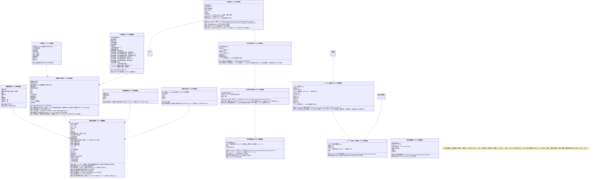

```mermaid
classDiagram
direction BT
note "「レセ請求履歴」「加算情報」は除外。中途終了は「下書き」なので、レスポンスを取得しても厳密には「履歴」にならない。一旦はリクエストだけを対象とする。HAORIであれば登録できるということであれば、保険・公費の負担割合、固定上限額、加算内容が返るだけでほぼリクエストと同一。"

    class レセコン患者基本情報["患者基本情報(レセコン外部接続)"] {
        患者ID 患者番号
        氏名（漢字）
        氏名（カナ）
        生年月日
        性別
        郵便番号
        住所1 都道府県・市町村・町域
        住所2 番地・建物名
        自宅電話番号
        携帯電話番号
        連絡先電話番号 連絡先と重複しているが存在するので定義
        連絡先 連絡先情報
        勤務先 連絡先情報
        帰省先 連絡先情報
        コメント1
        コメント2
        テスト患者区分
        死亡区分
        初回受診日
        最終受診日
        妊婦区分 対応:女性特有
        保険組合せ情報[]
        介護認定情報[]
        介護保険情報[]
        補足("禁忌、アレルギー、感染症、患者禁忌薬剤情報は電カル共有から取得するので除外")
        補足("職業等はあっても良い程度の情報は除外")
        補足("減免関係、入金方法、自動算定情報はレセコンの責務なので除外")
        補足("割引率は保険診療の文脈ではないので除外")
        補足("状態は標準マスタ等ではないので除外")
        補足("地域連携はオン資や電カル共有の文脈ではないので除外")
        補足("無床診療所なので入院・退院は除外")
        補足("個人番号情報は除外、原則としてレセコンで12桁のマイナンバーは扱ってはならない")
    }

    class レセコン連絡先情報["連絡先情報(レセコン外部接続)"] {
        連絡先名称
        連絡先区分 家族、帰省先、勤務先
        続柄
        郵便番号
        住所
        番地番号
        電話番号（昼）
        電話番号（夜）
        補足("続柄は文字列")
        補足("勤務先、帰省先を統合")
    }

    class レセコン保険組合せ情報["保険組合せ情報(レセコン外部接続)"] {
        保険組合せ番号
        外来負担割合
        保険の種類 ORCAの保険種別で標準ではない
        保険者番号
        保険の制度名称
        記号
        番号
        枝番
        本人家族区分
        被保険者名
        適用開始日
        適用終了日
        レセコン公費情報[]
        労災情報
        補足("無床診療所が対象なので入院は除外")
        補足("保険組合せ番号はORCA固有、レセコン側の患者の保険・公費情報を一意に特定する情報はどのレセコンでも必要")
        補足("保険情報はオン資から取得できる")
        補足("公費情報は、生活保護など一部を除きオン資から現在は取得できない")
        補足("継続区分、補助区分の表し方はレセコンにより異なるはずなので除外")
        補足("資格取得日、最終確認日は各保険・公費情報にあるべきでどの日付が入るかわからないので除外")
    }

    class レセコン公費情報["公費情報(レセコン外部接続)"] {
        公費種別 ORCAの公費種別で標準ではない
        公費の種類名称
        負担者番号
        受給者番号
        外来ー負担率
        外来ー固定額
        適用開始日
        適用終了日
        確認日付
        補足("無床診療所が対象なので入院は除外")
    }

    class レセコン労災情報["労災情報(レセコン外部接続)"] {
        労災自賠保険区分
        傷病の部位
        傷病年月日
        労働保険番号
        年金証書番号
        災害区分
        労働基準監督署コード
        労働基準監督署
        事業所情報・事業所名称
        事業所情報・所在地都道府県情報・都道府県名
        事業所情報・所在地都道府県情報・都道府県コード
        事業所情報・所在地都道府県情報・都道府県の区分
        事業所情報・所在地郡市区情報・郡市区名
        事業所情報・所在地郡市区情報・郡市区コード
        事業所情報・所在地郡市区情報・郡市の区分
        自賠責保険会社名
        アフターケア・健康管理手帳番号
        アフターケア損傷区分情報・損傷区分コード
        アフターケア損傷区分情報・損傷区分
        補足("労災が対象かを確認する")
        補足("電カルで労災情報がどこまでいるか確認する")
    }

    class 介護保険情報["介護認定情報(レセコン外部接続)"] {
        保険者番号
        被保険者番号
        開始日
        終了日
        補足("医療保険と介護保険と範囲が違うので必ずしもレセコンで管理されているわけではない")
    }

    class 介護認定情報["介護認定情報(レセコン外部接続)"] {
        要介護状態コード WAMの定義と同一に見えるが要確認
        要介護状態
        認定日
        開始日
        終了日
        対応("要介護度")
        補足("医療保険と介護保険と範囲が違うので必ずしもレセコンで管理されているわけではない")
    }
    レセコン患者基本情報 "1" *-- "1..*" レセコン連絡先情報
    レセコン患者基本情報 "1" *-- "1..*" レセコン保険組合せ情報
    レセコン患者基本情報 "1" *-- "0..*" 介護認定情報
    レセコン患者基本情報 "1" *-- "0..*" 介護保険情報
    レセコン保険組合せ情報 "1" *-- "0..*" レセコン公費情報
    レセコン保険組合せ情報 "1" *-- "0..1" レセコン労災情報

    class 会計情報["会計情報(レセコン外部接続)"] {
        会計情報ID PK
        患者情報ID FK
        患者ID 患者番号
        カルテID[] FK
        診療日
        診療時間
        リクエストキー（ORCA Medical_Uid 変更、削除に使用）
        連携日時 レセコン連携を行なった日時
        連携結果 成功、失敗などレセコンの連携結果を保持する
        外部API("ORCA API 中途終了データ作成 https://www.orca.med.or.jp/receipt/tec/api/medicalmod.html")
        補足("カルテとのリレーションはORCA APIの粒度と合わせたがレセコンにより異なることが想定される")
        補足("入院は対象外なので入院・外来区分は対象外")
        補足("電カルとレセコンの患者番号が一致する前提")
        補足("診療日、診療日時はORCAと合わせたがカルテn個に対してなので何を送るかは要検討")
    }
    カルテ "1..n" -- "0..1" 会計情報

    class 会計診療情報["会計診療情報(レセコン外部接続)"] {
        会計診療情報ID PK
        医師ID FK
        レセコン医師コード
        診療科ID FK
        レセコン診療科コード
        保険情報ID FK
        公費情報ID[] FK
        レセコン患者保険コード ORCA保険組合せ番号
        補足("医師等は外部連携用コードの方針が未定なのでIDと併記")
        補足("保険情報・公費情報は、レセコン用保険コード（ORCAだと保険組合せ番号）または保険情報・公費情報を送ることを想定")
    }
    会計診療情報 "1..n" -- "1" 会計情報

    class 会計診療行為情報["会計診療行為情報(レセコン外部接続)"] {
        会計診療行為情報ID PK
        診療区分 レセプトの2桁診療区分番号
        回数・日数
        外部API("ORCA API 中途終了データ作成 https://www.orca.med.or.jp/receipt/tec/api/medicalmod.html")
        補足("日数・回数はORCAに合わせて同一フィールドとした。日数、回数はいずれかしか設定しないので統合できる。")
        補足("ORCAの診療種別区分は、ORCAが診療区分から拡張したもので他レセコンには適用できない")
    }
    会計診療行為情報 "1..n" -- "1" 会計診療情報

    class 会計診療内容["会計診療内容(レセコン外部接続)"] {
        会計診療内容ID PK
        レセプト電産処理システムコード 医薬品、診療行為、特定器材、コメント
        数量
        一般名処方指示
        外部API("ORCA API 中途終了データ作成 https://www.orca.med.or.jp/receipt/tec/api/medicalmod.html")
        補足("「入力コード」はORCAで入力補助に使うエイリアス")
        補足("継続コメントは詳細が不明なので除外")
        補足("内服一種類区分はレセコンの責務と考え除外")
        補足("レセプトでは用法は不要")
    }
    会計診療内容 "1..n" -- "1" 会計診療行為情報

    class レセプト傷病名["レセプト傷病名(レセコン外部接続)"] {
        レセプト傷病名ID PK
        傷病名ID FK
        診療科ID nullable
        レセプト電産処理システムコード・傷病名マスタ
        主病名フラグ
        疑い病名フラグ
        急性フラグ
        開始年月日
        転帰区分
        転帰年月日
        補足コメント
        レセコン患者保険コード ORCA保険組合せ番号
        外部API("ORCA API 患者病名登録２ https://www.orca.med.or.jp/receipt/tec/api/diseasemod2.html")
        補足("以下の項目の対応は要検討。カルテ病名、疾患区分、レセプト表示、レセプト表示期間、保険病名、退院証明書、原疾患区分、合併症区分")
    }
    レセプト傷病名 "1" -- "1" 傷病名

    class レセプト傷病名修飾語["レセプト傷病名・修飾語(レセコン外部接続)"] {
        レセプト傷病名修飾語ID PK
        傷病名ID FK
        修飾語ID FK
        レセプト電産処理システムコード・傷病名マスタ
        順番
        外部API("ORCA API 患者病名登録２ https://www.orca.med.or.jp/receipt/tec/api/diseasemod2.html")
        補足("接頭語であるか、接尾語であるかはマスタで判定できるので不要")
    }
    レセプト傷病名修飾語 "0..n" -- "1" レセプト傷病名
    レセプト傷病名修飾語 "1" -- "1" 傷病名修飾語

    class 患者登録通知["患者登録通知(レセコン外部接続)"] {
        患者登録通知ID PK
        レセコンユーザーID
        患者登録更新モード add, modify, delete
        患者ID 患者番号
        登録日
        登録時間
        外部API("患者登録通知 https://www.orca.med.or.jp/receipt/tec/api/pushapi.html")
        補足("抽象化せずORCA PUSH APIをそのまま使用")
    }
```
