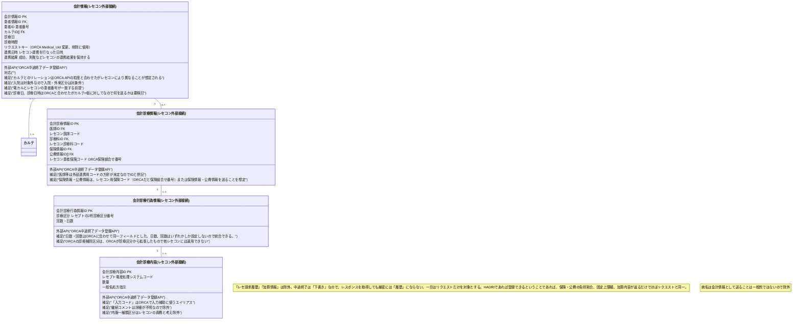

```mermaid
classDiagram
direction BT
note "「レセ請求履歴」「加算情報」は除外。中途終了は「下書き」なので、レスポンスを取得しても厳密には「履歴」にならない。一旦はリクエストだけを対象とする。HAORIであれば登録できるということであれば、保険・公費の負担割合、固定上限額、加算内容が返るだけでほぼリクエストと同一。"
note "病名は会計情報として送ることは一般的ではないので除外"

    class 会計情報["会計情報(レセコン外部接続)"] {
        会計情報ID PK
        患者情報ID FK
        患者ID 患者番号
        カルテID[] FK
        診療日
        診療時間
        リクエストキー（ORCA Medical_Uid 変更、削除に使用）
        連携日時 レセコン連携を行なった日時
        連携結果 成功、失敗などレセコンの連携結果を保持する
        外部API("ORCA中途終了データ登録API")
        対応("")
        補足("カルテとのリレーションはORCA APIの粒度と合わせたがレセコンにより異なることが想定される")
        補足("入院は対象外なので入院・外来区分は対象外")
        補足("電カルとレセコンの患者番号が一致する前提")
        補足("診療日、診療日時はORCAと合わせたがカルテn個に対してなので何を送るかは要検討")
    }
    カルテ "1..n" -- "0..1" 会計情報

    class 会計診療情報["会計診療情報(レセコン外部接続)"] {
        会計診療情報ID PK
        医師ID FK
        レセコン医師コード
        診療科ID FK
        レセコン診療科コード
        保険情報ID FK
        公費情報ID[] FK
        レセコン患者保険コード ORCA保険組合せ番号
        外部API("ORCA中途終了データ登録API")
        補足("医師等は外部連携用コードの方針が未定なのでIDと併記")
        補足("保険情報・公費情報は、レセコン用保険コード（ORCAだと保険組合せ番号）または保険情報・公費情報を送ることを想定")
    }
    会計診療情報 "1..n" -- "1" 会計情報

    class 会計診療行為情報["会計診療行為情報(レセコン外部接続)"] {
        会計診療行為情報ID PK
        診療区分 レセプトの2桁診療区分番号
        回数・日数
        外部API("ORCA中途終了データ登録API")
        補足("日数・回数はORCAに合わせて同一フィールドとした。日数、回数はいずれかしか設定しないので統合できる。")
        補足("ORCAの診療種別区分は、ORCAが診療区分から拡張したもので他レセコンには適用できない")
    }
    会計診療行為情報 "1..n" -- "1" 会計診療情報

    class 会計診療内容["会計診療内容(レセコン外部接続)"] {
        会計診療内容ID PK
        レセプト電産処理システムコード
        数量
        一般名処方指示
        外部API("ORCA中途終了データ登録API")
        補足("「入力コード」はORCAで入力補助に使うエイリアス")
        補足("継続コメントは詳細が不明なので除外")
        補足("内服一種類区分はレセコンの責務と考え除外")
    }
    会計診療内容 "1..n" -- "1" 会計診療行為情報
```
