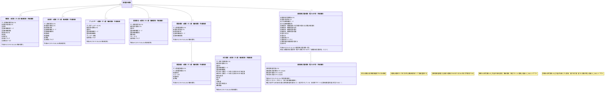

```mermaid
classDiagram
direction BT
    note "処方(6情報)は診療情報提供からのみ取得"
    note "5情報(6情報のうち処方以外)は臨床情報として直接登録する"
    note "診療情報提供書に記載の6情報はFHIRまたはCDAの形式で取得される"
    note "医療DX参考資料>00_共通>外部IF(薬剤、臨床情報、特定けんしん情報)>別紙3-2_XMLレイアウト"
    note "医療DX参考資料>00_共通>外部IF(オン資格、電子処方箋、電カル情報共有)>別紙3-1_XMLレイアウト"

    class オン資臨床傷病名["傷病名・6情報（オン資・臨床情報・外部接続）"] {
        オン資臨床傷病名ID PK
        患者基本情報ID FK
        登録日
        登録医療機関コード
        登録医療機関名
        傷病名区分名
        傷病名
        転帰状況
        未告知フラグ
        長期保存フラグ
        外部API("CIP-IF-001,002 臨床情報")
    }
    オン資臨床傷病名 "0..n" -- "1" 患者基本情報

    class オン資感染症["感染症・6情報（オン資・臨床情報・外部接続）"] {
        オン資感染症ID PK
        患者基本情報ID FK
        検体採取日時
        登録医療機関コード
        登録医療機関名
        検査項目
        検査結果
        基準値
        長期保存フラグ
        外部API("CIP-IF-001,002 臨床情報")
    }
    オン資感染症 "0..n" -- "1" 患者基本情報

    class オン資アレルギー["アレルギー・6情報（オン資・臨床情報・外部接続）"] {
        オン資アレルギーID PK
        患者基本情報ID FK
        登録日
        登録医療機関コード
        登録医療機関名
        アレルギー情報
        長期保存フラグ
        外部API("CIP-IF-001,002 臨床情報")
    }
    オン資アレルギー "0..n" -- "1" 患者基本情報

    class オン資薬剤禁忌["薬剤禁忌・6情報（オン資・臨床情報・外部接続）"] {
        オン資薬剤禁忌ID PK
        患者基本情報ID FK
        登録日
        登録医療機関コード
        登録医療機関名
        薬剤名称
        ステータス
        長期保存フラグ
        外部API("CIP-IF-001,002 臨床情報")
    }
    オン資薬剤禁忌 "0..n" -- "1" 患者基本情報

    class オン資検査情報["検査情報・6情報（オン資・臨床情報・外部接続）"] {
        オン資検査結果ID PK
        患者基本情報ID FK
        検体採取日時
        登録医療機関コード
        登録医療機関名
        外部API("CIP-IF-001,002 臨床情報")
    }
    オン資検査情報 "0..n" -- "1" 患者基本情報

    class オン資検査結果["検査結果・6情報（オン資・臨床情報・外部接続）"] {
        オン資検査結果ID PK
        オン資検査結果ID FK
        検査項目
        ステータス
        検査結果
        基準値
        外部API("CIP-IF-001,002 臨床情報")
    }
    オン資検査結果 "1..n" -- "1" オン資検査情報

    class オン資処方情報["処方情報・6情報（オン資・臨床情報・外部接続）"] {
        オン資処方情報群ID PK
        患者基本情報ID FK
        登録日
        登録医療機関コード
        登録医療機関名
        処方区分 業務コード仕様に記載とあるが未定義
        使用区分 業務コード仕様に記載とあるが未定義
        医薬品名称
        成分名
        用法
        1回用量
        用法等の特別指示
        調剤数量
        外部API("CIP-IF-001,002 臨床情報")
    }

    class 自施設宛文書情報["自施設宛文書情報（電カル共有・外部接続）"] {
        自施設宛文書情報ID PK
        患者基本情報ID FK
        紹介元医療機関コード
        紹介元医療機関名称
        資格情報・保険者番号 生活保護の場合は公費負担者番号
        資格情報・被保険者証記号
        資格情報・被保険者証番号
        資格情報・被保険者証枝番
        患者生年月日
        患者氏名
        文書情報ID FK
        文書情報ステータス
        診療情報提供書閲覧同意区分
        登録日時
        外部API("CIS-IF-111,112 自施設宛文書情報一覧")
        補足("自施設宛文書情報一覧から取得するものを「自施設宛文書情報」とした")
    }
    自施設宛文書情報 "0..n" -- "1" 患者基本情報

    class 診療情報提供書["自施設宛文書情報（電カル共有・外部接続）"] {
        診療情報提供書ID PK
        自施設宛文書情報ID FK nullable
        患者基本情報ID FK nullable
        作成済み文書ID FK nullable
        外部API("CIS-IF-113,114 文書情報取得")
        内包("デジ庁データモデル・送付先医療機関情報")
        補足("現状では対象の文書は診療情報提供書のみという書き方をしている（退院時サマリーは診療情報提供書に内包される）")
    }
    診療情報提供書 "1" -- "1" 自施設宛文書情報
```
