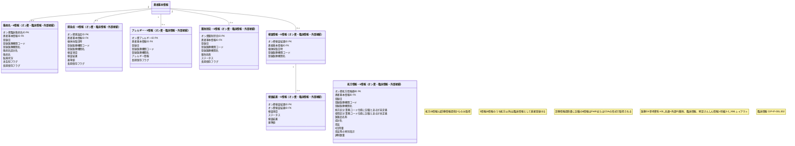

```mermaid
classDiagram
direction BT
    note "処方(6情報)は診療情報提供からのみ取得"
    note "5情報(6情報のうち処方以外)は臨床情報として直接登録する"
    note "診療情報提供書に記載の6情報はFHIRまたはCDAの形式で取得される"
    note "医療DX参考資料>00_共通>外部IF(薬剤、臨床情報、特定けんしん情報)>別紙3-2_XMLレイアウト"
    note "臨床情報 CIP-IF-001,002"

    class オン資臨床傷病名["傷病名・6情報（オン資・臨床情報・外部接続）"] {
        オン資臨床傷病名ID PK
        患者基本情報ID FK
        登録日
        登録医療機関コード
        登録医療機関名
        傷病名区分名
        傷病名
        転帰状況
        未告知フラグ
        長期保存フラグ
    }
    オン資臨床傷病名 "0..n" -- "1" 患者基本情報

    class オン資感染症["感染症・6情報（オン資・臨床情報・外部接続）"] {
        オン資感染症ID PK
        患者基本情報ID FK
        検体採取日時
        登録医療機関コード
        登録医療機関名
        検査項目
        検査結果
        基準値
        長期保存フラグ
    }
    オン資感染症 "0..n" -- "1" 患者基本情報

    class オン資アレルギー["アレルギー・6情報（オン資・臨床情報・外部接続）"] {
        オン資アレルギーID PK
        患者基本情報ID FK
        登録日
        登録医療機関コード
        登録医療機関名
        アレルギー情報
        長期保存フラグ
    }
    オン資アレルギー "0..n" -- "1" 患者基本情報

    class オン資薬剤禁忌["薬剤禁忌・6情報（オン資・臨床情報・外部接続）"] {
        オン資薬剤禁忌ID PK
        患者基本情報ID FK
        登録日
        登録医療機関コード
        登録医療機関名
        薬剤名称
        ステータス
        長期保存フラグ
    }
    オン資薬剤禁忌 "0..n" -- "1" 患者基本情報

    class オン資検査情報["検査情報・6情報（オン資・臨床情報・外部接続）"] {
        オン資検査結果ID PK
        患者基本情報ID FK
        検体採取日時
        登録医療機関コード
        登録医療機関名
    }
    オン資検査情報 "0..n" -- "1" 患者基本情報

    class オン資検査結果["検査結果・6情報（オン資・臨床情報・外部接続）"] {
        オン資検査結果ID PK
        オン資検査結果ID FK
        検査項目
        ステータス
        検査結果
        基準値
    }
    オン資検査結果 "1..n" -- "1" オン資検査情報

    class オン資処方情報["処方情報・6情報（オン資・臨床情報・外部接続）"] {
        オン資処方情報群ID PK
        患者基本情報ID FK
        登録日
        登録医療機関コード
        登録医療機関名
        処方区分 業務コード仕様に記載とあるが未定義
        使用区分 業務コード仕様に記載とあるが未定義
        医薬品名称
        成分名
        用法
        1回用量
        用法等の特別指示
        調剤数量
    }

```
