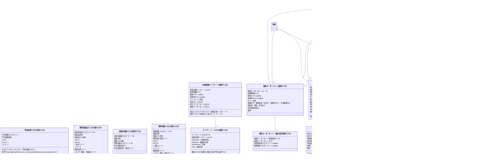

```mermaid
classDiagram
direction BT
    note "除外: デジ庁データモデル・後発医薬品リスト 一般名処方にすれば加算が取れるかはレセプト電産処理システム医薬品マスタに項目があり判定が可能"

    class 予防接種マスタ["予防接種マスタ(共通マスタ)"] {
        予防接種マスタコード
        予防接種名称
        HOT9
        HOT13
        YJコード
        対応("デジ庁データモデル・予防接種マスタ")
        参考("https://jpfhir.jp/fhir/core/1.1.1/StructureDefinition-jp-immunization.html")
    }

    class 標準医薬品マスタ["標準医薬品マスタ(共通マスタ)"] {
        標準医薬品マスタコード PK
        医薬品名称
        医薬品カナ名称
        HOT9
        HOT13
        一般名コード
        YJコード
        薬価基準コード
        レセプト電産・医薬品コード
    }

    class 自院用検査マスタ["自院用検査マスタ(医院マスタ)"] {
        自院用検査マスタコード PK
        検査名称
        検査カナ名称
        標準検査マスタコード FK
        外注検査会社ID
        外注検査会社・検査コード
    }

    class 標準検査マスタ["標準検査マスタ(共通マスタ)"] {
        標準検査マスタコード PK
        検査名称
        検査カナ名称
        標準病名交換コード
        HOT9
        HOT13
        一般名コード
        YJコード
        薬価基準コード
        レセプト電産・医薬品コード
    }

    class 汎用セットカテゴリー["汎用セットカテゴリー(医院マスタ)"] {
        汎用セットカテゴリーID PK
        医療機関ID FK
        医師ID FK nullable
        診療科ID FK nullable
        カテゴリー名称
        対応("デジ庁データモデル・汎用セットカテゴリー")
    }
    汎用セットカテゴリー "0..n" -- "1" 医療機関

    class 診療記録テンプレート["診療記録テンプレート(医院マスタ)"] {
        診療記録テンプレートID PK
        医療機関ID FK
        医師ID FK nullable
        診療科ID FK nullable
        テンプレート名称
        汎用セットID[] FK
        処方オーダーセットID[] FK
        検査オーダーセットID[] FK
        対応("デジ庁データモデル・診療記録テンプレート")
        補足("カルテの規定の下書きというイメージ")
    }

    class テンプレートSOAP["テンプレート・SOAP(医院マスタ)"] {
        テンプレートSOAPID PK
        診療記録テンプレートID FK
        Subjective : 主観的所見
        Objective : 客観的所見
        Assessment : 評価
        Plan : 治療方針
        補足("SOAP各項目に既定の文字列を設定する")
    }
    テンプレートSOAP "0..n" -- "1" 診療記録テンプレート

    class 汎用セット["汎用セット(医院マスタ)"] {
        汎用オーダーセットID PK
        汎用セットカテゴリーID FK
        医療機関ID FK
        医師ID FK nullable
        診療科ID FK nullable
        セット名称
        処方オーダーセットID[] FK
        検査オーダーセットID[] FK
        対応("デジ庁データモデル・汎用セット")
    }
    汎用セット "1..n" -- "1" 汎用セットカテゴリー
    汎用セット "0..n" -- "1" 医療機関
    汎用セット "0..n" -- "1" 医師
    汎用セット "0..n" -- "1" 診療科

    class 処方オーダーセット["処方オーダーセット(医院マスタ)"] {
        処方オーダーセットID PK
        医療機関ID FK
        医師ID FK nullable
        診療科ID FK nullable
        セット名称
        処方区分 : 内服、頓服、外用
        定期・臨時
        院外・院内
        用法 : 1日3回食後、痛い時、1日2回8時間ごとなど
        日数・回数 : 内服・定期処方の場合は日数、それ以外は回数
        備考
        対応("デジ庁データモデル・処方オーダーセット")
    }
    処方オーダーセット "0..n" -- "1" 汎用セット
    処方オーダーセット "0..n" -- "1" 医療機関
    処方オーダーセット "0..n" -- "1" 医師
    処方オーダーセット "0..n" -- "1" 診療科

    class 処方オーダーセット医薬品["処方オーダーセット・医薬品(医院マスタ)"] {
        処方オーダーセット医薬品 FK
        処方オーダーセットID FK
        標準医薬品マスターコード
        処方医薬品区分 : 一般名処方、変更不可（先発品指定）
        先発品区分 : 医師指定、患者希望 後発品不可の場合に指定する
        用量
        備考
        コメント("単位はマスターから取得する。")
    }
    処方オーダーセット医薬品 "1..n" -- "1" 処方オーダーセット

    class 検査オーダーセット["検査オーダーセット(医院マスタ)"] {
        検査オーダーセットID : PK
        医療機関ID FK
        医師ID FK nullable
        診療科ID FK nullable
        セット名称
        検査区分 : 検体検査（生化学、血液学など）、生理検査など
        優先度 : 通常、至急など
        外注検査会社ID
        備考
    }
    検査オーダーセット "0..n" -- "1" 汎用セット
    検査オーダーセット "0..n" -- "1" 医療機関
    検査オーダーセット "0..n" -- "1" 医師
    検査オーダーセット "0..n" -- "1" 診療科

    class 検査オーダーセット検査項目["検査オーダーセット・検査項目(医院マスタ)"] {
        検査オーダーセット検査項目ID : PK
        検査オーダーセットID FK
        自院用検査マスタコード nullable
        標準検査マスターコード nullable
    }
    検査オーダーセット検査項目  "1..n" -- "1" 検査オーダーセット

```
