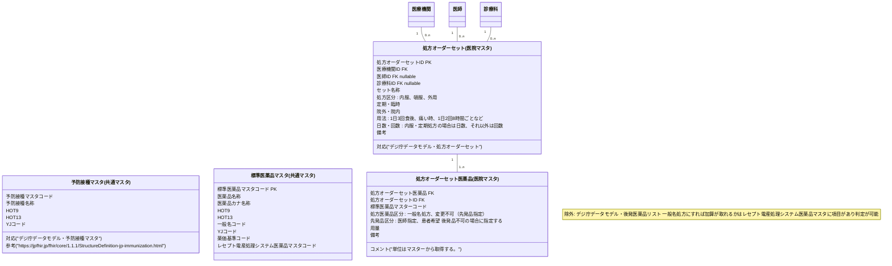

```mermaid
classDiagram
direction BT
    note "除外: デジ庁データモデル・後発医薬品リスト 一般名処方にすれば加算が取れるかはレセプト電産処理システム医薬品マスタに項目があり判定が可能"

    class 予防接種マスタ["予防接種マスタ(共通マスタ)"] {
        予防接種マスタコード
        予防接種名称
        HOT9
        HOT13
        YJコード
        対応("デジ庁データモデル・予防接種マスタ")
        参考("https://jpfhir.jp/fhir/core/1.1.1/StructureDefinition-jp-immunization.html")
    }

    class 標準医薬品マスタ["標準医薬品マスタ(共通マスタ)"] {
        標準医薬品マスタコード PK
        医薬品名称
        医薬品カナ名称
        HOT9
        HOT13
        一般名コード
        YJコード
        薬価基準コード
        レセプト電産処理システム医薬品マスタコード
    }

    class 処方オーダーセット["処方オーダーセット(医院マスタ)"] {
        処方オーダーセットID PK
        医療機関ID FK
        医師ID FK nullable
        診療科ID FK nullable
        セット名称
        処方区分 : 内服、頓服、外用
        定期・臨時
        院外・院内
        用法 : 1日3回食後、痛い時、1日2回8時間ごとなど
        日数・回数 : 内服・定期処方の場合は日数、それ以外は回数
        備考
        対応("デジ庁データモデル・処方オーダーセット")
    }
    処方オーダーセット "0..n" -- "1" 医療機関
    処方オーダーセット "0..n" -- "1" 医師
    処方オーダーセット "0..n" -- "1" 診療科

    class 処方オーダーセット医薬品["処方オーダーセット医薬品(医院マスタ)"] {
        処方オーダーセット医薬品 FK
        処方オーダーセットID FK
        標準医薬品マスターコード
        処方医薬品区分 : 一般名処方、変更不可（先発品指定）
        先発品区分 : 医師指定、患者希望 後発品不可の場合に指定する
        用量
        備考
        コメント("単位はマスターから取得する。")
    }
    処方オーダーセット医薬品 "1..n" -- "1" 処方オーダーセット

```
