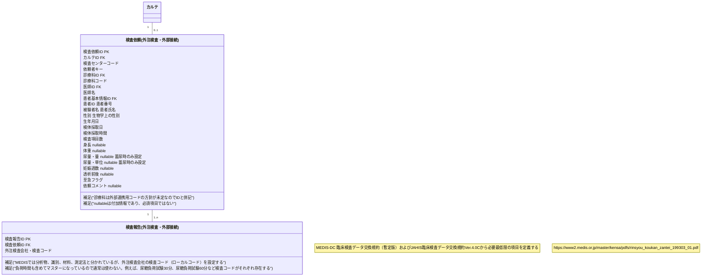

```mermaid
classDiagram
direction BT
note "MEDIS-DC 臨床検査データ交換規約（暫定版）およびJAHIS臨床検査データ交換規約Ver.4.0Cから必要最低限の項目を定義する"
note "https://www2.medis.or.jp/master/kensa/pdfs/rinsyou_koukan_zantei_199303_01.pdf"

    class 検査依頼["検査依頼(外注検査・外部接続)"] {
        検査依頼ID PK
        カルテID FK
        検査センターコード
        依頼者キー
        診療科ID FK
        診療科コード
        医師ID FK
        医師名
        患者基本情報ID FK
        患者ID 患者番号
        被験者名 患者氏名
        性別 生物学上の性別
        生年月日
        検体採取日
        検体採取時間
        検査項目数
        身長 nullable
        体重 nullable
        尿量・量 nullable 蓄尿時のみ設定
        尿量・単位 nullable 蓄尿時のみ設定
        妊娠週数 nullable
        透析前後 nullable
        至急フラグ
        依頼コメント nullable
        補足("診療科は外部連携用コードの方針が未定なのでIDと併記")
        補足("nullableは付加情報であり、必須項目ではない")
    }
    検査依頼 "0..1" -- "1" カルテ

    class 検査報告["検査報告(外注検査・外部接続)"] {
        検査報告ID PK
        検査依頼ID FK
        外注検査会社・検査コード
        補足("MEDISでは分析物、識別、材料、測定法と分かれているが、外注検査会社の検査コード（ローカルコード）を設定する")
        補足("負荷時間も含めてマスターになっているので通常は使わない。例えば、尿糖負荷試験30分、尿糖負荷試験60分など検査コードがそれぞれ存在する")
    }
    検査報告 "1..n" -- "1" 検査依頼
```
