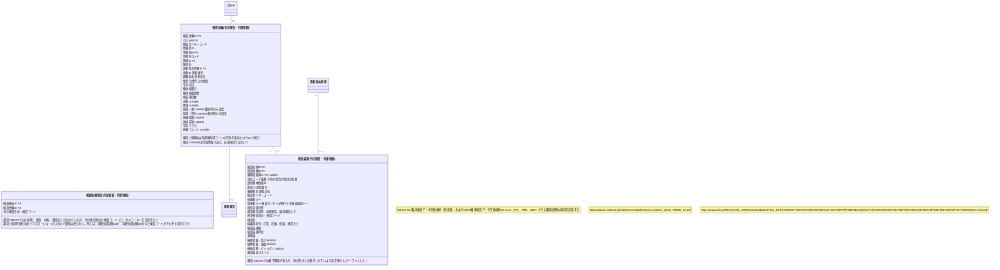

```mermaid
classDiagram
direction BT
note "MEDIS-DC 臨床検査データ交換規約（暫定版）およびJAHIS臨床検査データ交換規約Ver.4.0C（PID、OBR、OBX）から必要最低限の項目を定義する"
note "https://www2.medis.or.jp/master/kensa/pdfs/rinsyou_koukan_zantei_199303_01.pdf"
note "https://www.jahis.jp/files/user/04_JAHIS%20standard/16-004_JAHIS%E8%87%A8%E5%BA%8A%E6%A4%9C%E6%9F%BB%E3%83%87%E3%83%BC%E3%82%BF%E4%BA%A4%E6%8F%9B%E8%A6%8F%E7%B4%84Ver.4.0C.pdf"

    class 検査依頼["検査依頼(外注検査・外部接続)"] {
        検査依頼ID PK
        カルテID FK
        検査センターコード
        依頼者キー
        診療科ID FK
        診療科コード
        医師ID FK
        医師名
        患者基本情報ID FK
        患者ID 患者番号
        被験者名 患者氏名
        性別 生物学上の性別
        生年月日
        検体採取日
        検体採取時間
        検査項目数
        身長 nullable
        体重 nullable
        尿量・量 nullable 蓄尿時のみ設定
        尿量・単位 nullable 蓄尿時のみ設定
        妊娠週数 nullable
        透析前後 nullable
        至急フラグ
        依頼コメント nullable
        補足("診療科は外部連携用コードの方針が未定なのでIDと併記")
        補足("nullableは付加情報であり、必須項目ではない")
    }
    検査依頼 "0..1" -- "1" カルテ

    class 検査依頼項目["検査依頼項目(外注検査・外部接続)"] {
        検査報告ID PK
        検査依頼ID FK
        外注検査会社・検査コード
        補足("MEDISでは分析物、識別、材料、測定法と分かれているが、外注検査会社の検査コード（ローカルコード）を設定する")
        補足("負荷時間も含めてマスターになっているので通常は使わない。例えば、尿糖負荷試験30分、尿糖負荷試験60分など検査コードがそれぞれ存在する")
    }
    検査報告 "1..n" -- "1" 検査依頼

    class 検査結果["検査結果(外注検査・外部接続)"] {
        検査結果ID PK
        検査依頼ID FK
        親検査結果ID FK nullable
        項目コード枝番 子供の場合の項目の枝番
        患者基本情報ID
        患者ID 患者番号
        被験者名 患者氏名
        検査センターコード
        依頼者キー
        受託者キー 検査センターが発行する検査結果キー
        検査実施日時
        検査報告状態 : 中間報告、最終報告など
        外注検査会社・検査コード
        検査名
        結果値区分 : 正常、高値、低値、異常など
        検査結果値
        検査結果単位
        基準値
        検体状態・乳び MEDIS
        検体状態・溶血 MEDIS
        検体状態・ビリルビン MEDIS
        検査結果コメント
        補足("MEDISでは親子関係があるが、他の形式と比較がしやすいよう非正規化し1テーブルとした")
    }
    検査結果 "0..1" -- "1" 検査依頼
    検査結果 "0..n" -- "1" 患者基本情報
```
